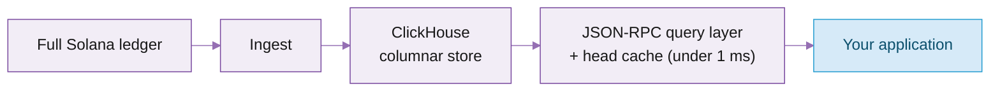

# Historical data

Triton serves the complete Solana ledger as historical data through **Superbank**, its historical-data backend. Superbank is an open-source Rust workspace that ingests the full ledger, stores it in ClickHouse, and serves it as spec-compliant Solana JSON-RPC. It is the historical module of RPC 2.0 and the successor to Old Faithful, open source under AGPL at [github.com/solana-rpc/superbank](https://github.com/solana-rpc/superbank).

Because it answers the standard Solana JSON-RPC methods, existing clients work unchanged: the historical methods you already call are served by Superbank automatically, with nothing to set up.

New here? The [Quickstart](https://kate-6.gitbook.io/triton-one-docs-v5/documentation/solana/historical-data/quickstart) reads an address's history with `getSignaturesForAddress`, `getTransaction`, and `getTransactionsForAddress`.

## What Superbank serves

The complete ledger from genesis: every block, transaction, and entry. Most Superbank methods match standard Solana JSON-RPC exactly; a few add an optional parameter or extend it.

| Methods | Features |
| --- | --- |
| `getBlock`, `getBlocks`, `getBlocksWithLimit`, `getBlockTime`, `getFirstAvailableBlock`, `getInflationReward`, `getSignatureStatuses` | Standard Solana JSON-RPC |
| `getTransaction`, `getSignaturesForAddress` | Triton's optional slot hint that lets you skip the database lookup (and get the response faster) when you already know the slot |
| `getTransactionsForAddress` | Triton's extension: a complete address history in one call (ATAs included) with server-side filters and pagination cursor |

`getTransactionsForAddress` is documented below. Responses are spec-compliant, so no client changes are needed when a method moves to Superbank from Old Faithful.

Superbank makes historical queries faster and cheaper. Benchmarked against public RPC at p50, it is 5x faster on `getSignaturesForAddress`, 38x on `getSignatureStatuses`, and 3.3x on `getTransaction`. Every historical query is priced the same, `$0.08 / GB` plus `$10 / million`, no matter how deep into history it reaches.

## How it works

You query Superbank with the standard Solana JSON-RPC methods. Behind that, it ingests the full ledger into ClickHouse (a columnar database) and translates each request into SQL tuned to how the data is sorted. A head cache keeps the newest slots in memory, so recent reads return in under 1 ms.



The full architecture (storage layout, materialised views, tiered storage) matters mostly if you self-host. See [Self-hosting](#self-hosting) below.

## getTransactionsForAddress

`getTransactionsForAddress` is designed for workloads that would otherwise call `getSignaturesForAddress` followed by `getTransaction` for every returned signature.

That two-step pattern works, but it creates an N+1 request flow: one request to discover signatures, then one more per transaction to fetch details. It also pushes filtering, pagination, token-account expansion, and result assembly onto the client.

This method combines those steps into a single address-history query. It can return either signature-level results or full transaction payloads, apply filters server-side, preserve a single pagination cursor, and optionally include token-account activity owned by the requested address.

It is a custom RPC method, not part of the standard Solana JSON-RPC API, but it follows the same JSON-RPC request and response envelope.

### Request

```json
{
  "jsonrpc": "2.0",
  "id": 1,
  "method": "getTransactionsForAddress",
  "params": [
    "AddressBase58",
    {
      "transactionDetails": "signatures",
      "sortOrder": "desc",
      "limit": 100,
      "paginationToken": null,
      "filters": {
        "slot": { "gte": 250000000 },
        "status": "any",
        "tokenAccounts": "none"
      }
    }
  ]
}
```

### Parameters

| Parameter | Type   | Required | Description                              |
| --------- | ------ | -------- | ---------------------------------------- |
| address   | string | Yes      | Base58 Solana account address to search. |
| options   | object | No       | Query options and filters.               |

### Options

| Option                         | Type                                   | Default                           | Description                                  |
| ------------------------------ | -------------------------------------- | --------------------------------- | -------------------------------------------- |
| transactionDetails             | signatures \| full                     | signatures                        | Controls response detail.                    |
| sortOrder                      | asc \| desc                            | desc                              | Sort by slot and transaction position.       |
| limit                          | number                                 | 1000 for signatures, 100 for full | Maximum number of results.                   |
| paginationToken                | string                                 | null                              | Token returned from a previous response.     |
| commitment                     | confirmed \| finalized                 | finalized                         | Commitment level.                            |
| minContextSlot                 | number                                 | none                              | Fails if the node has not reached this slot. |
| encoding                       | json \| jsonParsed \| base58 \| base64 | json                              | Used when transactionDetails is full.        |
| maxSupportedTransactionVersion | number                                 | none                              | Used when transactionDetails is full.        |
| filters                        | object                                 | none                              | Optional filters.                            |

### Filters

| Filter        | Type                          | Description                                                          |
| ------------- | ----------------------------- | -------------------------------------------------------------------- |
| slot          | comparison object             | Filter by slot. Supports gte, gt, lte, lt.                           |
| blockTime     | comparison object             | Filter by block time. Supports gte, gt, lte, lt, eq.                 |
| signature     | comparison object             | Filter by transaction signature position. Supports gte, gt, lte, lt. |
| status        | any \| succeeded \| failed    | Filter by transaction status.                                        |
| tokenAccounts | none \| balanceChanged \| all | Include token-owner activity for the address.                        |

Comparison object example:

```json
{
  "gte": 250000000,
  "lt": 260000000
}
```

### Token account filtering

`tokenAccounts` controls whether token-account activity owned by the requested address is included.

| Value          | Behaviour                                                                 |
| -------------- | ------------------------------------------------------------------------- |
| none           | Only transactions where the address appears directly.                     |
| all            | Also include transactions involving token accounts owned by the address.  |
| balanceChanged | Include owned token-account transactions only when token balance changed. |

Token-owner activity is derived from transaction pre/post token balance metadata.

### Response



When `transactionDetails` is `signatures`, each result contains transaction metadata.

```json
{
  "jsonrpc": "2.0",
  "result": {
    "data": [
      {
        "signature": "TransactionSignatureBase58",
        "slot": 250000001,
        "transactionIndex": 12,
        "err": null,
        "memo": null,
        "blockTime": 1700000000,
        "confirmationStatus": "finalized"
      }
    ],
    "paginationToken": "250000001:12"
  },
  "id": 1
}
```



When `transactionDetails` is `full`, each result contains the encoded transaction and metadata.

```json
{
  "jsonrpc": "2.0",
  "result": {
    "data": [
      {
        "slot": 250000001,
        "transactionIndex": 12,
        "blockTime": 1700000000,
        "transaction": {},
        "meta": {}
      }
    ],
    "paginationToken": "250000001:12"
  },
  "id": 1
}
```



### Pagination

Use the returned `paginationToken` in the next request to continue scanning.

```json
{
  "jsonrpc": "2.0",
  "id": 2,
  "method": "getTransactionsForAddress",
  "params": [
    "AddressBase58",
    {
      "limit": 100,
      "paginationToken": "250000001:12"
    }
  ]
}
```

### Example: successful transactions only

```json
{
  "jsonrpc": "2.0",
  "id": 1,
  "method": "getTransactionsForAddress",
  "params": ["AddressBase58", { "filters": { "status": "succeeded" } }]
}
```

### Example: token balance changes

```json
{
  "jsonrpc": "2.0",
  "id": 1,
  "method": "getTransactionsForAddress",
  "params": ["OwnerAddressBase58", { "filters": { "tokenAccounts": "balanceChanged" } }]
}
```

### Example: slot range

```json
{
  "jsonrpc": "2.0",
  "id": 1,
  "method": "getTransactionsForAddress",
  "params": ["AddressBase58", { "filters": { "slot": { "gte": 250000000, "lt": 251000000 } } }]
}
```

## Self-hosting

Superbank is open source under AGPL, so you can run, audit, and extend it yourself. Its source-agnostic ingest means you can backfill from BigTable or an existing archive and then switch to a live stream.

* Source and schemas: [github.com/solana-rpc/superbank](https://github.com/solana-rpc/superbank)
* Walkthrough: [Index Solana history with Superbank](https://kate-6.gitbook.io/triton-one-docs-v5/guides/solana/how-tos/index-solana-history-with-superbank)

Prefer not to operate it? Triton runs Superbank as a managed, globally distributed service. [Get an endpoint](https://customers.triton.one/onboarding).

<table data-card-size="large" data-view="cards"><thead><tr><th></th><th></th><th data-hidden data-card-target data-type="content-ref"></th></tr></thead><tbody><tr><td><i class="fa-sitemap">:sitemap:</i> <strong>Architecture breakdown</strong></td><td>How Superbank ingests, stores, and serves the full ledger.</td><td><a href="https://blog.triton.one/inside-superbank-architecture-breakdown">Inside Superbank</a></td></tr><tr><td><i class="fa-rocket">:rocket:</i> <strong>Self-hosting walkthrough</strong></td><td>Index Solana history with Superbank, from backfill to live tip.</td><td><a href="https://kate-6.gitbook.io/triton-one-docs-v5/guides/solana/how-tos/index-solana-history-with-superbank">Index Solana history with Superbank</a></td></tr></tbody></table>

***

<i class="fa-life-ring">:life-ring:</i> Contact support by clicking the chat icon in your [customer dashboard](https://customers.triton.one)\
<i class="fa-briefcase">:briefcase:</i> Sales questions? [Contact us](https://triton.one/contact)\
<i class="fa-sparkles">:sparkles:</i> AI agent? Read [llms.txt](https://docs.triton.one/llms.txt)\
<i class="fa-rss">:rss:</i> Follow updates: [Blog](https://blog.triton.one) · [X](https://x.com/triton_one) · [YouTube](https://www.youtube.com/@triton_one_ltd) · [Telegram](https://t.me/tritonone) · [GitHub](https://github.com/rpcpool)
