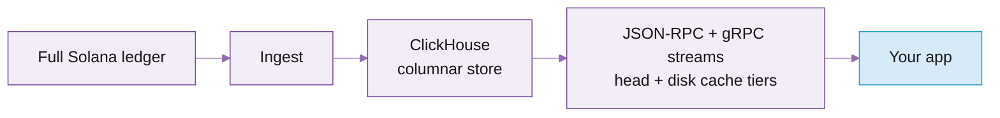

# Historical data

Superbank is an [open-source](https://github.com/solana-rpc/superbank) Rust workspace that ingests the full ledger, stores it in ClickHouse, and serves it as spec-compliant Solana JSON-RPC, adding advanced filters, native pagination, and a new `getTransactionsForAddress` method.

Because it's 100% compatible with the standard Solana JSON-RPC methods, existing clients work unchanged: all the historical methods you already call are served by our endpoints through the Superbank backend automatically.

## Features and benefits

<table data-card-size="large" data-view="cards"><thead><tr><th></th><th></th><th data-hidden data-card-target data-type="content-ref"></th></tr></thead><tbody><tr><td><i class="fa-gauge-high">:gauge-high:</i> <strong>Faster historical queries</strong></td><td>At p50 against public RPC: 5x faster getSignaturesForAddress, 38x getSignatureStatuses, 3.3x getTransaction.</td><td></td></tr><tr><td><i class="fa-list-check">:list-check:</i> <strong>Address history in one call</strong></td><td>getTransactionsForAddress returns a complete history (ATAs included) with server-side filters and a pagination cursor.</td><td></td></tr><tr><td><i class="fa-bolt">:bolt:</i> <strong>Sub-1 ms recent reads</strong></td><td>A head cache keeps the newest slots in memory, so recent reads return in under 1 ms.</td><td></td></tr><tr><td><i class="fa-coins">:coins:</i> <strong>Flat pricing across all the epochs and methods</strong></td><td>Every historical query (gTFA included) costs $0.08 / GB plus $10 / million calls.</td><td></td></tr></tbody></table>

## How it works

You query Superbank with the standard Solana JSON-RPC methods. Behind that, it ingests the full ledger into ClickHouse (a columnar database) and translates each request into SQL tuned to how the data is sorted.

Reads are tiered. A head cache holds the newest, not-yet-finalized slots in memory, so recent reads return in under 1 ms. An optional RocksDB disk cache serves recent finalized slots from local disk in place of ClickHouse. ClickHouse serves the full history, and a miss at any cache layer falls through to the next one automatically.



For the full architecture (storage layout, materialised views, tiered storage) see [Inside Superbank](https://blog.triton.one/inside-superbank-architecture-breakdown/).

## Supported methods

The complete ledger from genesis: every block, transaction, and entry. Most Superbank methods match standard Solana JSON-RPC exactly; a few add an optional parameter or extend it.

| Method | Returns |
| --- | --- |
| `getBlock`, `getBlocks`, `getBlocksWithLimit`, `getBlockTime`, `getBlockHeight`, `getSlot`, `getTransactionCount`, `getLatestBlockhash`, `getFirstAvailableBlock`, `getInflationReward`, `getSignatureStatuses`, `getHealth`, `minimumLedgerSlot` | Standard Solana JSON-RPC |
| `getTransaction` | Standard, plus Triton's optional `slot` hint (`u64`): skips the ledger-wide signature search by querying that exact slot. The response is `null` if the signature isn't present in that slot |
| `getSignaturesForAddress` | Standard, plus Triton's `beforeSlot`/`untilSlot` (`u64`): exclusive whole-slot bounds (`slot < beforeSlot`, `slot > untilSlot`), not signature-position cursors. `beforeSlot` can't be combined with `before`, nor `untilSlot` with `until` |
| `getTransactionsForAddress` | Triton's extension: a complete address history in one call (ATAs included) with server-side filters (by status, slot, block time, and token accounts) and a pagination cursor |
| `StreamBlocks`, `StreamTransactions` | Triton's gRPC streaming extension: replay bounded slot ranges of history as a stream, with server-side filters. See [Streaming historical data](#streaming-historical-data) |

Serving notes:

* JSON-RPC batch envelopes are supported.
* `minimumLedgerSlot` reports the lowest slot retained in Superbank's ClickHouse-backed block storage.
* On `getSignaturesForAddress`, if the signature you pass as `before` or `until` can't be found, the call returns JSON-RPC error `-32020` (`Transaction <signature> not found`).
* With the head cache, `processed` commitment is served on the signature and transaction methods (`getSignaturesForAddress`, `getSignatureStatuses`, `getTransaction`, `getTransactionsForAddress`) and the slot and block-list methods (`getSlot`, `getBlockHeight`, `getTransactionCount`, `getLatestBlockhash`, `getBlocks`, `getBlocksWithLimit`). `getBlock`, `getBlockTime`, `getFirstAvailableBlock`, and `getInflationReward` take `confirmed` or `finalized`.


## getTransactionsForAddress

`getTransactionsForAddress` is designed for workloads that would otherwise call `getSignaturesForAddress` followed by `getTransaction` for every returned signature.

That two-step pattern works, but it creates an N+1 request flow: one request to discover signatures, then one more per transaction to fetch details. It also pushes filtering, pagination, token-account expansion, and result assembly onto the client.

This method combines those steps into a single address-history query. It can return either signature-level results or full transaction payloads, apply filters server-side, preserve a single pagination cursor, and optionally include token-account activity owned by the requested address.

It is a custom RPC method, not part of the standard Solana JSON-RPC API, but it follows the same JSON-RPC request and response envelope.

### Request

```json
{
  "jsonrpc": "2.0",
  "id": 1,
  "method": "getTransactionsForAddress",
  "params": [
    "AddressBase58",
    {
      "transactionDetails": "signatures",
      "sortOrder": "desc",
      "limit": 100,
      "paginationToken": null,
      "filters": {
        "slot": { "gte": 250000000 },
        "status": "any",
        "tokenAccounts": "none"
      }
    }
  ]
}
```

<details>

<summary>Parameters</summary>

| Parameter | Type   | Required | Description                              |
| --------- | ------ | -------- | ---------------------------------------- |
| address   | string | Yes      | Base58 Solana account address to search. |
| options   | object | No       | Query options and filters.               |

</details>


<details>

<summary>Options</summary>

| Option                         | Type                                   | Default                           | Description                                  |
| ------------------------------ | -------------------------------------- | --------------------------------- | -------------------------------------------- |
| transactionDetails             | signatures \| full                     | signatures                        | Controls response detail.                    |
| sortOrder                      | asc \| desc                            | desc                              | Sort by slot and transaction position.       |
| limit                          | number                                 | 1000 for signatures, 100 for full | Maximum number of results.                   |
| paginationToken                | string                                 | null                              | Token returned from a previous response.     |
| commitment                     | confirmed \| finalized                 | finalized                         | Commitment level.                            |
| minContextSlot                 | number                                 | none                              | Fails if the node has not reached this slot. |
| encoding                       | json \| jsonParsed \| base58 \| base64 | json                              | Used when transactionDetails is full.        |
| maxSupportedTransactionVersion | number                                 | none                              | Used when transactionDetails is full.        |
| filters                        | object                                 | none                              | Optional filters.                            |

</details>


<details>

<summary>Filters</summary>

| Filter        | Type                          | Description                                                          |
| ------------- | ----------------------------- | -------------------------------------------------------------------- |
| slot          | comparison object             | Filter by slot. Supports gte, gt, lte, lt.                           |
| blockTime     | comparison object             | Filter by block time. Supports gte, gt, lte, lt, eq.                 |
| signature     | comparison object             | Filter by transaction signature position. Supports gte, gt, lte, lt. |
| status        | any \| succeeded \| failed    | Filter by transaction status.                                        |
| tokenAccounts | none \| balanceChanged \| all | Include token-owner activity for the address.                        |

Comparison object example:

```json
{
  "gte": 250000000,
  "lt": 260000000
}
```

`beforeSlot` and `untilSlot` are accepted as aliases for `filters.slot.lt` and `filters.slot.gt`. An alias can't be combined with a same-side slot filter (`lt`/`lte` for `beforeSlot`, `gt`/`gte` for `untilSlot`).

</details>


<details>

<summary>Token account filtering</summary>

`tokenAccounts` controls whether token-account activity owned by the requested address is included.

| Value          | Behaviour                                                                 |
| -------------- | ------------------------------------------------------------------------- |
| none           | Only transactions where the address appears directly.                     |
| all            | Also include transactions involving token accounts owned by the address.  |
| balanceChanged | Include owned token-account transactions only when token balance changed. |

Token-owner activity is derived from transaction pre/post token balance metadata, so these filters require the token-owner activity table to be populated.

</details>


### Response



When `transactionDetails` is `signatures`, each result contains transaction metadata.

```json
{
  "jsonrpc": "2.0",
  "result": {
    "data": [
      {
        "signature": "TransactionSignatureBase58",
        "slot": 250000001,
        "transactionIndex": 12,
        "err": null,
        "memo": null,
        "blockTime": 1700000000,
        "confirmationStatus": "finalized"
      }
    ],
    "paginationToken": "XHLKq2uNiGAJs3YhjnmnwT7LuJoTkGDqf1k4WJsnUd4A6e9bfB26vHr4dKLfMqwZuPmuXDHih4RaojCSt61os33"
  },
  "id": 1
}
```



When `transactionDetails` is `full`, each result contains the encoded transaction, its metadata, and its version.

```json
{
  "jsonrpc": "2.0",
  "result": {
    "data": [
      {
        "slot": 250000001,
        "transactionIndex": 12,
        "blockTime": 1700000000,
        "transaction": {},
        "meta": {},
        "version": 0
      }
    ],
    "paginationToken": "XHLKq2uNiGAJs3YhjnmnwT7LuJoTkGDqf1k4WJsnUd4A6e9bfB26vHr4dKLfMqwZuPmuXDHih4RaojCSt61os33"
  },
  "id": 1
}
```



### Examples



```json
{
  "jsonrpc": "2.0",
  "id": 1,
  "method": "getTransactionsForAddress",
  "params": ["AddressBase58", { "filters": { "status": "succeeded" } }]
}
```



```json
{
  "jsonrpc": "2.0",
  "id": 1,
  "method": "getTransactionsForAddress",
  "params": ["OwnerAddressBase58", { "filters": { "tokenAccounts": "balanceChanged" } }]
}
```



```json
{
  "jsonrpc": "2.0",
  "id": 1,
  "method": "getTransactionsForAddress",
  "params": ["AddressBase58", { "filters": { "slot": { "gte": 250000000, "lt": 251000000 } } }]
}
```



`paginationToken` is the signature of the last transaction in the page. Pass it back in the next request to continue scanning; treat it as an opaque token.

```json
{
  "jsonrpc": "2.0",
  "id": 2,
  "method": "getTransactionsForAddress",
  "params": [
    "AddressBase58",
    {
      "limit": 100,
      "paginationToken": "XHLKq2uNiGAJs3YhjnmnwT7LuJoTkGDqf1k4WJsnUd4A6e9bfB26vHr4dKLfMqwZuPmuXDHih4RaojCSt61os33"
    }
  ]
}
```



## Streaming historical data

Superbank also serves history as gRPC streams alongside JSON-RPC, for server-side-filtered bulk pulls where paginating JSON-RPC calls would be the slow path. Both methods replay bounded, inclusive slot ranges straight from ClickHouse.



Streams one message per block in the range, with block metadata, rewards, and transaction payloads:

```bash
grpcurl -proto superbank.proto \
  -d '{ "start_slot": 250000000, "end_slot": 250000009 }' \
  <your-endpoint>:10000 superbank.Superbank/StreamBlocks
```



Streams one message per matching transaction. Filter server-side by accounts, votes, and success or failure:

```bash
grpcurl -proto superbank.proto \
  -d '{
    "start_slot": 250000000,
    "end_slot": 250000009,
    "filter": {
      "vote": false,
      "failed": false,
      "account_include": ["EPjFWdd5AufqSSqeM2qN1xzybapC8G4wEGGkZwyTDt1v"]
    }
  }' \
  <your-endpoint>:10000 superbank.Superbank/StreamTransactions
```



The proto lives at [superbank.proto](https://github.com/solana-rpc/superbank/blob/main/crates/superbank-rpc/proto/superbank.proto), and `10000` is the default gRPC port. The proto also defines unary methods and a bidirectional `Get` for compatibility; in v1 they return `UNIMPLEMENTED`.

## Self-hosting

Superbank is open source under AGPL, so you can run, audit, and extend it yourself. Its source-agnostic ingest means you can backfill from BigTable or an existing archive and then switch to a live stream.

* Source and schemas: [github.com/solana-rpc/superbank](https://github.com/solana-rpc/superbank)
* Walkthrough: [Index Solana history with Superbank](https://app.gitbook.com/s/TpqU5Dqc6tdzY8J23dd7/solana/how-tos/index-solana-history-with-superbank)

Prefer not to operate it? Triton runs Superbank as a managed, globally distributed service. [Get an endpoint](https://customers.triton.one/onboarding).

<table data-card-size="large" data-view="cards"><thead><tr><th></th><th></th><th data-hidden data-card-target data-type="content-ref"></th></tr></thead><tbody><tr><td><i class="fa-sitemap">:sitemap:</i> <strong>Architecture breakdown</strong></td><td>How Superbank ingests, stores, and serves the full ledger.</td><td><a href="https://blog.triton.one/inside-superbank-architecture-breakdown">Inside Superbank</a></td></tr><tr><td><i class="fa-rocket">:rocket:</i> <strong>Self-hosting walkthrough</strong></td><td>Index Solana history with Superbank, from backfill to live tip.</td><td><a href="https://app.gitbook.com/s/TpqU5Dqc6tdzY8J23dd7/solana/how-tos/index-solana-history-with-superbank">Index Solana history with Superbank</a></td></tr></tbody></table>

## What's next

<table data-card-size="large" data-view="cards"><thead><tr><th></th><th></th><th data-hidden data-card-target data-type="content-ref"></th></tr></thead><tbody><tr><td><i class="fa-play">:play:</i> <strong>Quickstart</strong></td><td>Read an address's full history in one call, back to genesis, in under 2 minutes.</td><td><a href="https://app.gitbook.com/s/Xz3Ki4zincxsnRG91NNt/solana/historical-data/quickstart">Quickstart</a></td></tr><tr><td><i class="fa-list-check">:list-check:</i> <strong>Best practices</strong></td><td>Query history efficiently: pagination, filters, and cost control at scale.</td><td><a href="https://app.gitbook.com/s/Xz3Ki4zincxsnRG91NNt/solana/historical-data/best-practices">Best practices</a></td></tr></tbody></table>

***

<i class="fa-life-ring">:life-ring:</i> Contact support by clicking the chat icon in your [customer dashboard](https://customers.triton.one)\
<i class="fa-briefcase">:briefcase:</i> Sales questions? [Contact us](https://triton.one/contact)\
<i class="fa-sparkles">:sparkles:</i> AI agent? Read [llms.txt](https://docs.triton.one/llms.txt)\
<i class="fa-rss">:rss:</i> Follow updates: [Blog](https://blog.triton.one) · [X](https://x.com/triton_one) · [YouTube](https://www.youtube.com/@triton_one_ltd) · [Telegram](https://t.me/tritonone) · [GitHub](https://github.com/rpcpool)
