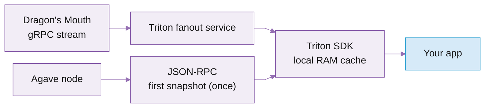

# Account Sync

Account Sync is a feature of the Triton SDK that makes your polling faster and cheaper, with next-to-no migration effort. It automatically merges your account reads into a single streaming subscription, keeps updates cached locally, and resolves your calls from RAM.

## Use cases

Account Sync fits any app that reads account state in a loop. It streams over both gRPC and WebSocket, so it works in Node backends, workers, and scripts as well as browser frontends:

* **Wallets and portfolio UIs** reading balances and token accounts continuously.
* **DEXs and trading dashboards** tracking pool and market state across many accounts.
* **Games and NFT marketplaces** polling on-chain state per frame and per view.
* **Explorers and analytics frontends** rendering decoded account data in real time.
* **Bots and services** with rotating wallet and token watchlists.

For latency-critical trading (HFT, MEV, liquidation engines), direct [Dragon's Mouth gRPC](../real-time-streaming/dragon-s-mouth-grpc.md) streaming is still the fastest path.

## Features and benefits

<table data-card-size="large" data-view="cards"><thead><tr><th></th><th></th><th data-hidden data-card-target data-type="content-ref"></th></tr></thead><tbody><tr><td><i class="fa-list-check">:list-check:</i> <strong>Drop-in account reads</strong></td><td><code>getAccountInfo</code>, <code>getMultipleAccountsInfo</code>, and their context and parsed variants, all served from the local cache.</td><td></td></tr><tr><td><i class="fa-bolt">:bolt:</i> <strong>Streaming-grade freshness after the first read</strong></td><td>The first read fetches once over JSON-RPC and opens a stream; every read after resolves from RAM with live updates, no round-trip.</td><td></td></tr><tr><td><i class="fa-infinity">:infinity:</i> <strong>Unlimited local polling</strong></td><td>Reads hit local RAM, so you can poll as aggressively as you want (every 10 ms or less) without rate limits or per-call cost.</td><td></td></tr><tr><td><i class="fa-filter">:filter:</i> <strong>Filter your data</strong></td><td>Trim payloads with <code>dataSlice</code> and gate reads on <code>minContextSlot</code>, the same options web3.js takes.</td><td></td></tr></tbody></table>

## How it works

The SDK fills its local buffer in two ways:

1. It does an initial JSON-RPC account fetch for each account you track.
2. It keeps a stream open and applies live account updates as they arrive.



The Triton fanout service keeps one upstream Dragon's Mouth subscription and routes each account update to the SDK connections that asked for it. Your SDK seeds the cache with a JSON-RPC snapshot on the first read, then applies stream updates as they arrive, so `getAccountInfo` reads from the local buffer.

This is why the main `endpoint` still matters: the SDK uses it for normal web3.js RPC calls and for the first account snapshot, then the stream endpoint keeps the state fresh.

```ts
const connection = new Connection(rpcEndpoint, {
  accountSync: {
    subscriptionEndpoint: streamEndpoint,
    transport: "grpc",
  },
});
```

The stream runs over gRPC or WebSocket. gRPC is for Node backends, workers, and scripts; WebSocket works in Node and browsers, so browser apps use the same SDK over WebSocket. TypeScript and bundlers use the package exports to pick the browser or backend build automatically.

### Read options

The read methods take the same argument shape as web3.js: a commitment string, or a config object.

```ts
await connection.getAccountInfo(account, "confirmed");
```

```ts
await connection.getAccountInfo(account, {
  commitment: "confirmed",
  dataSlice: { offset: 8, length: 32 },
  minContextSlot: 123456,
});
```

| Option           | Meaning                                                                   |
| ---------------- | ------------------------------------------------------------------------- |
| `commitment`     | Reads from the buffer for `"processed"`, `"confirmed"`, or `"finalized"`. |
| `dataSlice`      | Returns only part of the account data.                                    |
| `minContextSlot` | Waits for a buffered account update at or above this slot.                |

`minContextSlot` is checked against the SDK local buffer, not a node. If the stream does not deliver an update at or above that slot before `missTimeoutMs`, the read returns `null`.

## Supported methods and helpers

The SDK works as a web3.js-compatible `Connection`. Account reads are served from the stream-fed buffer; every other web3.js method routes to a normal RPC request.



| Method                                                   | What it does                                                        |
| -------------------------------------------------------- | ------------------------------------------------------------------- |
| `getAccountInfo(publicKey, config?)`                     | Gets one account from the local stream-fed buffer.                  |
| `getAccountInfoAndContext(publicKey, config?)`           | Gets one account plus a context slot.                               |
| `getMultipleAccountsInfo(publicKeys, config?)`           | Gets many accounts from the local buffer.                           |
| `getMultipleAccountsInfoAndContext(publicKeys, config?)` | Gets many accounts plus one context slot.                           |
| `getParsedAccountInfo(publicKey, config?)`               | Gets one account and returns parsed data when parsing is supported. |
| `getMultipleParsedAccounts(publicKeys, config?)`         | Gets many parsed accounts.                                          |



```ts
getAccountInfo(
  publicKey: PublicKey,
  commitmentOrConfig?: Commitment | GetAccountInfoConfig,
): Promise<AccountInfo<Buffer> | null>;
```



```ts
getAccountInfoAndContext(
  publicKey: PublicKey,
  commitmentOrConfig?: Commitment | GetAccountInfoConfig,
): Promise<RpcResponseAndContext<AccountInfo<Buffer> | null>>;
```



```ts
getMultipleAccountsInfo(
  publicKeys: PublicKey[],
  commitmentOrConfig?: Commitment | GetMultipleAccountsConfig,
): Promise<(AccountInfo<Buffer> | null)[]>;
```



```ts
getMultipleAccountsInfoAndContext(
  publicKeys: PublicKey[],
  commitmentOrConfig?: Commitment | GetMultipleAccountsConfig,
): Promise<RpcResponseAndContext<(AccountInfo<Buffer> | null)[]>>;
```



```ts
getParsedAccountInfo(
  publicKey: PublicKey,
  commitmentOrConfig?: Commitment | GetAccountInfoConfig,
): Promise<RpcResponseAndContext<AccountInfo<Buffer | ParsedAccountData> | null>>;
```



```ts
getMultipleParsedAccounts(
  publicKeys: PublicKey[],
  rawConfig?: GetMultipleAccountsConfig,
): Promise<RpcResponseAndContext<(AccountInfo<Buffer | ParsedAccountData> | null)[]>>;
```





| Method                       | What it does                                      |
| ---------------------------- | ------------------------------------------------- |
| `addAccounts(accountIds)`    | Adds accounts to the live stream.                 |
| `removeAccounts(accountIds)` | Stops tracking accounts.                          |
| `setAccounts(accountIds)`    | Replaces the full tracked account list.           |
| `close()`                    | Closes the stream and releases resources.         |
| `getLastTransportError()`    | Returns the latest stream error, if one happened. |

```ts
addAccounts(accountIds: ReadonlyArray<string | PublicKey>): Promise<void>;
removeAccounts(accountIds: ReadonlyArray<string | PublicKey>): Promise<void>;
setAccounts(accountIds: ReadonlyArray<string | PublicKey>): Promise<void>;
close(): Promise<void>;
getLastTransportError(): Error | null;
```

In Node, the config type is `NodeAccountSyncConnectionConfig`; in browser code, it is `BrowserAccountSyncConnectionConfig`.



| Helper                                               | What it does                                                                    |
| ---------------------------------------------------- | ------------------------------------------------------------------------------- |
| `convertAccountData(data, fromEncoding, toEncoding)` | Converts account data between supported encodings.                              |
| `encodeAccount(account, encoding, options?)`         | Encodes account info into a Solana RPC-style account shape.                     |
| `parseJsonParsed(account, options?)`                 | Parses account data into `jsonParsed` form when supported.                      |
| `loadAccountEncodingWasm()`                          | Loads the WASM account encoder explicitly. Most users do not need this.         |

```ts
import { convertAccountData } from "@triton-one/triton-sdk";

const base58Data = await convertAccountData(
  "base64-account-data-here",
  "base64",
  "base58",
);

console.log(base58Data);
```

Supported encodings: `binary`, `base58`, `base64`, `base64+zstd`, `jsonParsed`. Most users do not need these helpers; use them when you need raw account data in a specific Solana RPC encoding.



## Install the SDK

```bash
npm install @triton-one/triton-sdk
```

The SDK re-exports web3.js types and helpers, so most apps import from one package:

```ts
import { Connection, PublicKey } from "@triton-one/triton-sdk";
```

If your app already uses web3.js, the first change is usually the import:

```diff
- import { Connection, PublicKey } from "@solana/web3.js";
+ import { Connection, PublicKey } from "@triton-one/triton-sdk";
```

### Migrate from web3.js

For many apps, migration is small:

1. Install `@triton-one/triton-sdk`.
2. Change imports from `@solana/web3.js` to `@triton-one/triton-sdk`.
3. Add `accountSync` options to your `Connection`.
4. Keep calling `getAccountInfo` and `getMultipleAccountsInfo` like before.
5. Call `close()` when the connection is no longer needed.



```ts
import { Connection, PublicKey } from "@solana/web3.js";

const accountId = "ping6gwBZx1ccMMFyLgkVSupUmujYrFidEXuNRPq989";
const connection = new Connection("https://api.mainnet-beta.solana.com");
const account = await connection.getAccountInfo(new PublicKey(accountId));
```



```ts
import { Connection, PublicKey } from "@triton-one/triton-sdk";

const accountId = "ping6gwBZx1ccMMFyLgkVSupUmujYrFidEXuNRPq989";
const connection = new Connection("https://api.rpcpool.com/YOUR_TOKEN", {
  accountSync: {
    transport: "grpc",
    initialAccounts: [accountId],
  },
});

const account = await connection.getAccountInfo(new PublicKey(accountId));

await connection.close();
```



## Get started

Pick your transport: gRPC for Node backends, workers, and scripts; WebSocket for browsers (it also works in Node). Point both at your Triton endpoint: `https://` for gRPC, `wss://` for WebSocket.



```ts
import { Connection, PublicKey } from "@triton-one/triton-sdk";

const endpoint = "https://api.rpcpool.com/YOUR_TOKEN";
const account = new PublicKey("ping6gwBZx1ccMMFyLgkVSupUmujYrFidEXuNRPq989");

const connection = new Connection(endpoint, {
  commitment: "confirmed",
  accountSync: {
    transport: "grpc",
    initialAccounts: [account],
    commitment: "confirmed",
    missTimeoutMs: 5_000,
  },
});

try {
  const accountInfo = await connection.getAccountInfo(account);

  if (accountInfo === null) {
    console.log("No account data is available yet.");
  } else {
    console.log("Lamports:", accountInfo.lamports);
    console.log("Owner:", accountInfo.owner.toBase58());
    console.log("Data bytes:", accountInfo.data.length);
  }
} finally {
  await connection.close();
}
```



Browsers only support WebSocket; do not use `transport: "grpc"` in browser code. Your bundler picks the browser build from the package automatically.

```ts
import { Connection, PublicKey } from "@triton-one/triton-sdk";

const rpcEndpoint = "https://api.rpcpool.com/YOUR_TOKEN";
const wsEndpoint = "wss://api.rpcpool.com/YOUR_TOKEN";
const account = new PublicKey("ping6gwBZx1ccMMFyLgkVSupUmujYrFidEXuNRPq989");

const connection = new Connection(rpcEndpoint, {
  commitment: "confirmed",
  accountSync: {
    transport: "ws",
    subscriptionEndpoint: wsEndpoint,
    initialAccounts: [account],
    commitment: "confirmed",
  },
});

try {
  const accountInfo = await connection.getAccountInfo(account);
  console.log(accountInfo);
} finally {
  await connection.close();
}
```



## Connection request

The SDK keeps the normal web3.js `Connection` shape and adds one config key, `accountSync`, for the streaming transport, stream endpoint, account list, commitment, and cache-miss behaviour.

```ts
const connection = new Connection(endpoint, {
  commitment: "confirmed",
  accountSync: {
    transport: "grpc",
    subscriptionEndpoint: endpoint,
    commitment: "confirmed",
    initialAccounts: [],
    autoSubscribeOnMiss: true,
    missTimeoutMs: 5_000,
  },
});
```

| Option                 | Default                     | Meaning                                                                                                                                                                              |
| ---------------------- | --------------------------- | ------------------------------------------------------------------------------------------------------------------------------------------------------------------------------------ |
| `transport`            | `"ws"` in Node and browser  | Stream transport. Node can use `"grpc"` or `"ws"`; browsers can only use `"ws"`. Use `"grpc"` in Node backends, workers, and scripts; use `"ws"` in browsers or if your network blocks gRPC. |
| `subscriptionEndpoint` | Derived from `endpoint`     | Stream endpoint. Set it when your stream endpoint differs from your RPC endpoint. In most cases it is the same Triton endpoint.                                                      |
| `commitment`           | `"confirmed"`               | Stream commitment: `"processed"`, `"confirmed"`, or `"finalized"`.                                                                                                                  |
| `initialAccounts`      | `[]`                        | Accounts to subscribe to as soon as the connection starts.                                                                                                                          |
| `autoSubscribeOnMiss`  | `true`                      | If you read an account that is not tracked yet, subscribe to it and wait.                                                                                                          |
| `missTimeoutMs`        | `5000`                      | How long to wait for account data before returning `null`.                                                                                                                         |

Choose `missTimeoutMs` carefully. The timeout exists because an account might not exist yet: the SDK does not always return RPC-style `null` immediately, because many apps deterministically derive an account address and want the data the moment that account is created in real time.

## Sending a request

Account reads keep their web3.js signatures, and every call resolves from the local buffer.



```ts
import { Connection, PublicKey } from "@triton-one/triton-sdk";

const connection = new Connection("https://api.rpcpool.com/YOUR_TOKEN", {
  accountSync: {
    transport: "grpc",
    initialAccounts: ["ping6gwBZx1ccMMFyLgkVSupUmujYrFidEXuNRPq989"],
  },
});

const publicKey = new PublicKey("ping6gwBZx1ccMMFyLgkVSupUmujYrFidEXuNRPq989");
const accountInfo = await connection.getAccountInfo(publicKey);

if (accountInfo) {
  console.log(accountInfo.lamports);
  console.log(accountInfo.owner.toBase58());
}

await connection.close();
```



Use this when you need to know which slot the data came from.

```ts
const response = await connection.getAccountInfoAndContext(publicKey, {
  commitment: "confirmed",
});

console.log("slot:", response.context.slot);
console.log("account:", response.value);
```

If `response.value` is `null`, the context slot is `0`.



The result order matches the input order.

```ts
const accounts = await connection.getMultipleAccountsInfo([
  new PublicKey("ping6gwBZx1ccMMFyLgkVSupUmujYrFidEXuNRPq989"),
  new PublicKey("So11111111111111111111111111111111111111112"),
]);

for (const accountInfo of accounts) {
  if (accountInfo === null) {
    console.log("missing account");
  } else {
    console.log(accountInfo.lamports);
  }
}
```



```ts
const response = await connection.getMultipleAccountsInfoAndContext(
  [
    new PublicKey("ping6gwBZx1ccMMFyLgkVSupUmujYrFidEXuNRPq989"),
    new PublicKey("So11111111111111111111111111111111111111112"),
  ],
  { commitment: "confirmed" },
);

console.log("slot:", response.context.slot);
console.log("accounts:", response.value);
```

For multiple-account reads, the context slot is the lowest slot among the returned non-null accounts. If every account is `null`, the context slot is `0`.



Use parsed reads when you want web3.js-style parsed account data.

```ts
const response = await connection.getParsedAccountInfo(
  new PublicKey("So11111111111111111111111111111111111111112"),
  { commitment: "confirmed" },
);

console.log(response.context.slot);
console.log(response.value?.data);
```

Many parsed accounts:

```ts
const response = await connection.getMultipleParsedAccounts(
  [
    new PublicKey("So11111111111111111111111111111111111111112"),
    new PublicKey("TokenkegQfeZyiNwAJbNbGKPFXCWuBvf9Ss623VQ5DA"),
  ],
  { commitment: "confirmed" },
);

console.log(response.value);
```

If a program parser is not supported, the SDK falls back to raw base64 account data, matching normal RPC behaviour.



## Filter your data

Shape what each read returns. These options layer onto any of the read calls above.



Use `dataSlice` when you only need a small part of account data.

```ts
const accountInfo = await connection.getAccountInfo(publicKey, {
  commitment: "confirmed",
  dataSlice: { offset: 8, length: 32 },
});

console.log(accountInfo?.data);
```

`dataSlice` changes `accountInfo.data`, not `accountInfo.space`. `space` is the full account data size.



Use `minContextSlot` when you only want data from a slot at or above a known slot.

```ts
const accountInfo = await connection.getAccountInfo(publicKey, {
  commitment: "confirmed",
  minContextSlot: 250_000_000,
});

if (accountInfo === null) {
  console.log("The local buffer did not reach that slot in time.");
}
```

The SDK checks `minContextSlot` against the latest stream update in its local buffer, not against a node. If the buffer does not reach that slot before `missTimeoutMs`, the read returns `null`.



## Manage the tracked account set

The tracked account set is the list of accounts the SDK asks the stream to send updates for. Start with `initialAccounts`, then change the set while your app runs. Account ids can be strings or `PublicKey` values.



Keep the current tracked accounts and add more:

```ts
await connection.addAccounts([
  "ping6gwBZx1ccMMFyLgkVSupUmujYrFidEXuNRPq989",
  new PublicKey("So11111111111111111111111111111111111111112"),
]);
```

After this call, those accounts are part of the live stream.



Stop live updates for some accounts:

```ts
await connection.removeAccounts([
  "ping6gwBZx1ccMMFyLgkVSupUmujYrFidEXuNRPq989",
]);
```

This stops tracking those accounts on the stream. It does not erase account data already stored in the local buffer.



Replace the full tracked set:

```ts
await connection.setAccounts([
  new PublicKey("So11111111111111111111111111111111111111112"),
]);
```

After this call, the stream tracks only the accounts in the new list.



Notes:

* Duplicate accounts are normalised to one tracked account.
* Bad public keys throw before the stream is updated.
* These methods update the stream used by the connection's default `accountSync.commitment`.
* If `autoSubscribeOnMiss` is `true`, reading an untracked account can add it to the stream automatically.

## Auto-subscribe on miss

By default, if you call `getAccountInfo` for an account that is not tracked, the SDK subscribes to it and waits up to `missTimeoutMs`.

```ts
const connection = new Connection(endpoint, {
  accountSync: {
    transport: "grpc",
    autoSubscribeOnMiss: true,
    missTimeoutMs: 10_000,
  },
});
```

To make reads return `null` immediately for untracked accounts, turn it off:

```ts
const connection = new Connection(endpoint, {
  accountSync: {
    transport: "grpc",
    autoSubscribeOnMiss: false,
  },
});
```

## Close the connection

Call `close()` when your script, test, or app page is done with the connection. For a long-running server, call it during shutdown.

```ts
await connection.close();
```

## Check stream errors

If account reads keep returning `null`, the stream is the first place to look.

```ts
const error = connection.getLastTransportError();

if (error) {
  console.error("stream error:", error.message);
}
```

### Why a read returns `null`

`getAccountInfo` returning `null` is normal. Common reasons:

* The account does not exist.
* The account is not tracked and `autoSubscribeOnMiss` is `false`.
* The stream has not delivered the account yet.
* The account did not reach `minContextSlot` before `missTimeoutMs`.
* The endpoint, token, or transport is wrong.
* You are asking for a different commitment than the stream has delivered.

Make sure the account is tracked, give the stream time to deliver, then retry:

```ts
const connection = new Connection(endpoint, {
  accountSync: {
    transport: "grpc",
    initialAccounts: [publicKey],
    autoSubscribeOnMiss: true,
    missTimeoutMs: 10_000,
  },
});

for (let attempt = 0; attempt < 10; attempt += 1) {
  const accountInfo = await connection.getAccountInfo(publicKey);

  if (accountInfo) {
    console.log(accountInfo);
    break;
  }

  await new Promise((resolve) => setTimeout(resolve, 500));
}
```

### Common mistakes

* **Using gRPC in the browser.** Browsers cannot use `@grpc/grpc-js`. Use `transport: "ws"` in browser apps.
* **Forgetting to close in scripts.** If a script does not exit, call `await connection.close()`.
* **Passing a bad public key.** All account ids must be valid Solana public keys.
* **Expecting old historical state.** The SDK stores the latest streamed state, not a historical database. For account state from a past slot, use a service built for historical reads.

## Pricing

Account Sync is billed on bandwidth only, `$0.08 / GB` of streamed data, with no per-call charge.

## What's next

<table data-card-size="large" data-view="cards"><thead><tr><th></th><th></th><th data-hidden data-card-target data-type="content-ref"></th></tr></thead><tbody><tr><td><i class="fa-radio">:radio:</i> <strong>Dragon's Mouth gRPC</strong></td><td>The streaming backbone Account Sync rides on. Go direct for the lowest-latency account and transaction data.</td><td><a href="https://kate-6.gitbook.io/triton-one-docs-v5/documentation/solana/real-time-streaming/dragon-s-mouth-grpc">Dragon's Mouth gRPC</a></td></tr><tr><td><i class="fa-rotate-right">:rotate-right:</i> <strong>Whirligig WebSockets</strong></td><td>Drop-in for native Solana WebSockets, backed by gRPC. The fastest real-time data for frontends.</td><td><a href="https://kate-6.gitbook.io/triton-one-docs-v5/documentation/solana/real-time-streaming/whirligig-websockets">Whirligig WebSockets</a></td></tr></tbody></table>

***

<i class="fa-life-ring">:life-ring:</i> Contact support by clicking the chat icon in your [customer dashboard](https://customers.triton.one)\
<i class="fa-briefcase">:briefcase:</i> Sales questions? [Contact us](https://triton.one/contact)\
<i class="fa-sparkles">:sparkles:</i> AI agent? Read [llms.txt](https://docs.triton.one/llms.txt)\
<i class="fa-rss">:rss:</i> Follow updates: [Blog](https://blog.triton.one) · [X](https://x.com/triton_one) · [YouTube](https://www.youtube.com/@triton_one_ltd) · [Telegram](https://t.me/tritonone) · [GitHub](https://github.com/rpcpool)
