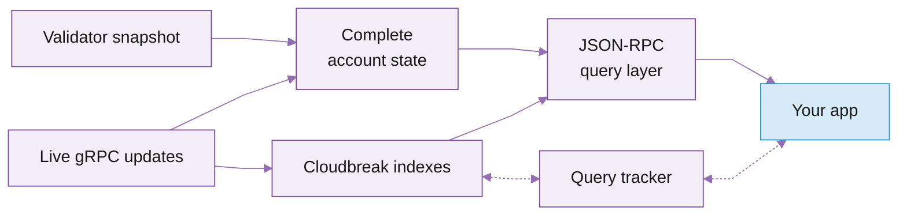

# Cloudbreak Accounts

Cloudbreak serves `getProgramAccounts`, account lookups, and SPL token queries from a purpose-built index, so they stay fast even for programs with millions of accounts. Supported methods are answered by the index automatically, and there is nothing to enable or route on your side.


## Use cases

* **Reading many program accounts at scale** (DEXes, lending protocols, indexers): repeated `getProgramAccounts` queries with `memcmp` or `dataSize` filters are served from tailored indexes instead of a full scan.
* **SPL token queries** by owner, delegate, or mint, plus token balances, against a Token program that holds hundreds of millions of accounts.
* **Account lookups at volume**, answered from the index with complete Agave parity, verified against the validator's own account hash.

**What not to use it for.** Cloudbreak answers point-in-time queries; for a live stream of account changes, use [Dragon's Mouth](https://app.gitbook.com/s/Xz3Ki4zincxsnRG91NNt/solana/real-time-streaming/dragon-s-mouth-grpc). `processed` commitment is not served on Cloudbreak-routed methods.

## Features and benefits

<table data-card-size="large" data-view="cards"><thead><tr><th></th><th></th><th data-hidden data-card-target data-type="content-ref"></th></tr></thead><tbody><tr><td><i class="fa-magnifying-glass">:magnifying-glass:</i> <strong>Fast getProgramAccounts</strong></td><td>getProgramAccounts against a program with a large account set, especially with memcmp or dataSize filters you run repeatedly.</td><td></td></tr><tr><td><i class="fa-check-double">:check-double:</i> <strong>Complete Agave parity</strong></td><td>Complete parity with Agave on 8 methods for querying account state, verified against the validator's own account hash.</td><td></td></tr><tr><td><i class="fa-coins">:coins:</i> <strong>SPL token queries</strong></td><td>SPL token queries by owner, delegate, or mint, plus token balances.</td><td></td></tr><tr><td><i class="fa-bolt">:bolt:</i> <strong>Dynamic indexing on live traffic</strong></td><td>Indexes are built automatically from real query traffic: heavily requested filter shapes get their own index, with nothing to configure on your side.</td><td></td></tr></tbody></table>

## How it works

Cloudbreak builds its index from a validator snapshot for the starting state and a Yellowstone gRPC stream of account updates to stay current. It tracks both `confirmed` and `finalized` commitment as the chain advances, so a query reads the same state the chain has reached at the commitment you ask for.

It verifies its data against the validator's own account hash: a lattice hash computed over every account's address, lamports, owner, executable flag, and data. When that hash matches the validator's, the indexed state is identical to on-chain state at that slot.



### How indexes get created

A `getProgramAccounts` query is fast when an index matches its filter shape. Cloudbreak creates these indexes from real traffic: it counts the query shapes it receives, and once a shape is requested often enough it builds the matching index automatically, backing off while the index catches up so this never competes with ingestion. SPL Token program queries are handled by the dedicated token methods rather than this path.

A query with no matching index yet still returns correct results, it just runs slower until the index is built.

## Supported methods

| Method | Returns |
| --- | --- |
| `getAccountInfo`             | A single account, or `null`. |
| `getMultipleAccounts`        | An array of accounts (each `null` if missing), in input order. |
| `getBalance`                 | The lamport balance of an account. |
| `getProgramAccounts`         | All accounts owned by a program, with filters. |
| `getTokenAccountsByOwner`    | SPL Original and Token-2022 token accounts owned by a wallet. |
| `getTokenAccountsByDelegate` | SPL Original and Token-2022 accounts a delegate controls. |
| `getTokenAccountsByMint`     | SPL Original and Token-2022 accounts of a given mint. |
| `getTokenAccountBalance`     | The token amount held by a token account. |
| `getSlot`                    | The current slot at a commitment level. |
| `getVersion`                 | The upstream Solana version and Cloudbreak build. |
| `getGenesisHash`             | The cluster genesis hash. |
| `getHealth`                  | Service health. |

### getAccountInfo

Returns the account at a single address, or `null` if it is not in the indexed set. Compatible with the standard [Solana `getAccountInfo` API](https://solana.com/docs/rpc/http/getaccountinfo).

Position 0 is the account pubkey (base58), required. Position 1 is an optional config object:

| Field            | Required | Default     | Description                                                    |
| ---------------- | -------- | ----------- | -------------------------------------------------------------- |
| `encoding`       | optional | `binary`    | `base64`, `base58`, `base64+zstd`, or `jsonParsed`.            |
| `dataSlice`      | optional | full data   | `{ "offset": <number>, "length": <number> }`.                  |
| `commitment`     | optional | `finalized` | `confirmed` or `finalized`.                                    |
| `minContextSlot` | optional | none        | Fail with `-32000` if the index has not reached this slot yet. |



```json
{
  "jsonrpc": "2.0",
  "id": 1,
  "method": "getAccountInfo",
  "params": [
    "4fYNw3dojWmQ4dXtSGE9epjRGy9pFSx62YypT7avPYvA",
    { "encoding": "base64", "commitment": "confirmed" }
  ]
}
```



```json
{
  "jsonrpc": "2.0",
  "id": 1,
  "result": {
    "context": { "slot": 250000042 },
    "value": {
      "lamports": 1234567,
      "owner": "675kPX9MHTjS2zt1qfr1NYHuzeLXfQM9H24wFSUt1Mp8",
      "executable": false,
      "rentEpoch": 18446744073709551615,
      "space": 752,
      "data": ["<base64-string>", "base64"]
    }
  }
}
```



When the account is not found, `value` is `null`.

### getMultipleAccounts

Returns one entry per requested address, in the same order, with `null` for any address not in the indexed set. Compatible with the standard [Solana `getMultipleAccounts` API](https://solana.com/docs/rpc/http/getmultipleaccounts).

Position 0 is an array of pubkeys (base58), required. Position 1 is the same optional config object as `getAccountInfo`.



```json
{
  "jsonrpc": "2.0",
  "id": 1,
  "method": "getMultipleAccounts",
  "params": [
    [
      "4fYNw3dojWmQ4dXtSGE9epjRGy9pFSx62YypT7avPYvA",
      "11111111111111111111111111111111"
    ],
    { "encoding": "base64" }
  ]
}
```



```json
{
  "jsonrpc": "2.0",
  "id": 1,
  "result": {
    "context": { "slot": 250000042 },
    "value": [
      {
        "lamports": 1234567,
        "owner": "675kPX9MHTjS2zt1qfr1NYHuzeLXfQM9H24wFSUt1Mp8",
        "executable": false,
        "rentEpoch": 18446744073709551615,
        "space": 752,
        "data": ["<base64-string>", "base64"]
      },
      null
    ]
  }
}
```



### getBalance

Returns the lamport balance of an account, or `0` if it is not in the indexed set. Compatible with the standard [Solana `getBalance` API](https://solana.com/docs/rpc/http/getbalance).

Position 0 is the account pubkey (base58), required. Position 1 is an optional config object accepting `commitment` and `minContextSlot`.



```json
{
  "jsonrpc": "2.0",
  "id": 1,
  "method": "getBalance",
  "params": [
    "4fYNw3dojWmQ4dXtSGE9epjRGy9pFSx62YypT7avPYvA",
    { "commitment": "confirmed" }
  ]
}
```



```json
{
  "jsonrpc": "2.0",
  "id": 1,
  "result": {
    "context": { "slot": 250000042 },
    "value": 1234567
  }
}
```



### getProgramAccounts

Returns every account owned by a program, with optional filtering. This is the method Cloudbreak is built to accelerate. Compatible with the standard [Solana `getProgramAccounts` API](https://solana.com/docs/rpc/http/getprogramaccounts).

Position 0 is the program pubkey (base58 string), required. Position 1 is an optional config object:

| Field            | Required | Default     | Description                                                                                 |
| ---------------- | -------- | ----------- | ------------------------------------------------------------------------------------------- |
| `encoding`       | optional | `binary`    | `base64`, `base58`, `base64+zstd`, or `jsonParsed`.                                         |
| `filters`        | optional | none        | Array of `memcmp` and/or `dataSize` filters. All filters must match.                        |
| `dataSlice`      | optional | full data   | `{ "offset": <number>, "length": <number> }`. Returns only that byte range of account data. |
| `commitment`     | optional | `finalized` | `confirmed` or `finalized`.                                                                 |
| `minContextSlot` | optional | none        | Fail with `-32000` if the index has not reached this slot yet.                              |
| `withContext`    | optional | `false`     | When `true`, wrap the result in `{ "context": { "slot": N }, "value": [...] }`.             |

A `memcmp` filter matches a base58-encoded byte sequence at a fixed offset: `{ "memcmp": { "offset": 32, "bytes": "<base58-bytes>" } }`. A `dataSize` filter matches accounts of an exact data length: `{ "dataSize": 165 }`.

The example below fetches Raydium AMM accounts of a fixed size at `confirmed`, asking for the slot context alongside the result.



```json
{
  "jsonrpc": "2.0",
  "id": 1,
  "method": "getProgramAccounts",
  "params": [
    "675kPX9MHTjS2zt1qfr1NYHuzeLXfQM9H24wFSUt1Mp8",
    {
      "encoding": "base64",
      "commitment": "confirmed",
      "withContext": true,
      "filters": [{ "dataSize": 752 }]
    }
  ]
}
```



```json
{
  "jsonrpc": "2.0",
  "id": 1,
  "result": {
    "context": { "slot": 250000042 },
    "value": [
      {
        "pubkey": "58oQChx4yWmvKdwLLZzBi4ChoCc2fqCUWBkwMihLYQo2",
        "account": {
          "lamports": 1234567,
          "owner": "675kPX9MHTjS2zt1qfr1NYHuzeLXfQM9H24wFSUt1Mp8",
          "executable": false,
          "rentEpoch": 18446744073709551615,
          "space": 752,
          "data": ["<base64-string>", "base64"]
        }
      }
    ]
  }
}
```



Without `withContext`, `result` is the array directly rather than the `{ context, value }` envelope, matching standard Solana RPC behaviour.


`getProgramAccounts` responses are streamed back as a chunked HTTP body, so a client can begin parsing accounts before the query finishes and peak memory stays bounded on both ends. Standard HTTP and JSON-RPC clients consume the chunked body transparently. If a request fails before the first batch is sent, you get a normal JSON-RPC error. If it fails partway through streaming, the body is truncated and your JSON parser reports an incomplete document. Treat a parse error on a large response as a failed request and retry.


### getTokenAccountsByOwner

Returns the Original and Token-2022 token accounts owned by a wallet, both from the. Cloudbreak indexes the token owner and mint as dedicated columns, so this method stays fast even though the SPL Token program holds hundreds of millions of accounts. Compatible with the standard [Solana `getTokenAccountsByOwner` API](https://solana.com/docs/rpc/http/gettokenaccountsbyowner).


For SPL token data, use the token methods rather than a raw `getProgramAccounts` against the Token program. The token methods hit purpose-built indexes; an unfiltered `getProgramAccounts` over the entire Token program is not indexed and is not a supported access pattern.


Position 0 is the owner pubkey (base58), required. Position 1 is a filter object, required, with exactly one of:

| Filter                               | Description                                                                                                                          |
| ------------------------------------ | ------------------------------------------------------------------------------------------------------------------------------------ |
| `{ "mint": "<mint-pubkey>" }`        | Restrict to a single mint.                                                                                                           |
| `{ "programId": "<token-program>" }` | Restrict to SPL Token (`TokenkegQfeZyiNwAJbNbGKPFXCWuBvf9Ss623VQ5DA`) or Token-2022 (`TokenzQdBNbLqP5VEhdkAS6EPFLC1PHnBqCXEpPxuEb`). |

Position 2 is an optional config object accepting `encoding`, `dataSlice`, `commitment`, and `minContextSlot`, with the same meanings as in `getProgramAccounts`.

The example below fetches a wallet's USDC accounts and decodes them with `jsonParsed`.



```json
{
  "jsonrpc": "2.0",
  "id": 1,
  "method": "getTokenAccountsByOwner",
  "params": [
    "<owner-wallet-pubkey>",
    { "mint": "EPjFWdd5AufqSSqeM2qN1xzybapC8G4wEGGkZwyTDt1v" },
    { "encoding": "jsonParsed", "commitment": "confirmed" }
  ]
}
```



```json
{
  "jsonrpc": "2.0",
  "id": 1,
  "result": {
    "context": { "slot": 250000042 },
    "value": [
      {
        "pubkey": "<token-account-pubkey>",
        "account": {
          "lamports": 2039280,
          "owner": "TokenkegQfeZyiNwAJbNbGKPFXCWuBvf9Ss623VQ5DA",
          "executable": false,
          "rentEpoch": 18446744073709551615,
          "space": 165,
          "data": {
            "program": "spl-token",
            "parsed": {
              "type": "account",
              "info": {
                "mint": "EPjFWdd5AufqSSqeM2qN1xzybapC8G4wEGGkZwyTDt1v",
                "owner": "<owner-wallet-pubkey>",
                "tokenAmount": {
                  "amount": "1000000",
                  "decimals": 6,
                  "uiAmount": 1.0,
                  "uiAmountString": "1"
                },
                "state": "initialized",
                "isNative": false
              }
            },
            "space": 165
          }
        }
      }
    ]
  }
}
```



The token methods always wrap their result in the `{ context, value }` envelope, matching standard Solana RPC.

### getTokenAccountsByDelegate

Identical parameters and response shape to `getTokenAccountsByOwner`, but position 0 is the delegate pubkey and results are the Original and Token-2022 token accounts that delegate has authority over. Compatible with the standard [Solana `getTokenAccountsByDelegate` API](https://solana.com/docs/rpc/http/gettokenaccountsbydelegate).



```json
{
  "jsonrpc": "2.0",
  "id": 1,
  "method": "getTokenAccountsByDelegate",
  "params": [
    "<delegate-pubkey>",
    { "programId": "TokenkegQfeZyiNwAJbNbGKPFXCWuBvf9Ss623VQ5DA" },
    { "encoding": "jsonParsed" }
  ]
}
```



```json
{
  "jsonrpc": "2.0",
  "id": 1,
  "result": {
    "context": { "slot": 250000042 },
    "value": [
      {
        "pubkey": "<token-account-pubkey>",
        "account": {
          "lamports": 2039280,
          "owner": "TokenkegQfeZyiNwAJbNbGKPFXCWuBvf9Ss623VQ5DA",
          "executable": false,
          "rentEpoch": 18446744073709551615,
          "space": 165,
          "data": {
            "program": "spl-token",
            "parsed": {
              "type": "account",
              "info": {
                "mint": "EPjFWdd5AufqSSqeM2qN1xzybapC8G4wEGGkZwyTDt1v",
                "owner": "<owner-wallet-pubkey>",
                "delegate": "<delegate-pubkey>",
                "delegatedAmount": {
                  "amount": "500000",
                  "decimals": 6,
                  "uiAmount": 0.5,
                  "uiAmountString": "0.5"
                },
                "state": "initialized",
                "isNative": false
              }
            },
            "space": 165
          }
        }
      }
    ]
  }
}
```



### getTokenAccountsByMint

Returns the Original and Token-2022 token accounts of a given mint. This is a Cloudbreak extension; standard Solana RPC has no `getTokenAccountsByMint`. Position 0 is the mint pubkey (base58), required. Position 1 is an optional config object:

| Field            | Required | Default     | Description                                                    |
| ---------------- | -------- | ----------- | -------------------------------------------------------------- |
| `programId`      | optional | SPL Token   | Token program to query: SPL Token or Token-2022.               |
| `encoding`       | optional | `binary`    | `base64`, `base58`, `base64+zstd`, or `jsonParsed`.            |
| `dataSlice`      | optional | full data   | `{ "offset": <number>, "length": <number> }`.                  |
| `commitment`     | optional | `finalized` | `confirmed` or `finalized`.                                    |
| `minContextSlot` | optional | none        | Fail with `-32000` if the index has not reached this slot yet. |

The result is always wrapped in the `{ context, value }` envelope and is streamed like `getProgramAccounts`.



```json
{
  "jsonrpc": "2.0",
  "id": 1,
  "method": "getTokenAccountsByMint",
  "params": [
    "EPjFWdd5AufqSSqeM2qN1xzybapC8G4wEGGkZwyTDt1v",
    { "encoding": "jsonParsed", "commitment": "confirmed" }
  ]
}
```



```json
{
  "jsonrpc": "2.0",
  "id": 1,
  "result": {
    "context": { "slot": 250000042 },
    "value": [
      {
        "pubkey": "<token-account-pubkey>",
        "account": {
          "lamports": 2039280,
          "owner": "TokenkegQfeZyiNwAJbNbGKPFXCWuBvf9Ss623VQ5DA",
          "executable": false,
          "rentEpoch": 18446744073709551615,
          "space": 165,
          "data": {
            "program": "spl-token",
            "parsed": {
              "type": "account",
              "info": {
                "mint": "EPjFWdd5AufqSSqeM2qN1xzybapC8G4wEGGkZwyTDt1v",
                "owner": "<owner-wallet-pubkey>",
                "tokenAmount": {
                  "amount": "1000000",
                  "decimals": 6,
                  "uiAmount": 1.0,
                  "uiAmountString": "1"
                },
                "state": "initialized",
                "isNative": false
              }
            },
            "space": 165
          }
        }
      }
    ]
  }
}
```



### getTokenAccountBalance

Returns the token amount held by a token account. Compatible with the standard [Solana `getTokenAccountBalance` API](https://solana.com/docs/rpc/http/gettokenaccountbalance).

Position 0 is the token account pubkey (base58), required. Position 1 is an optional commitment config `{ "commitment": "confirmed" }`. Unlike the other methods, this one does not accept `minContextSlot`.



```json
{
  "jsonrpc": "2.0",
  "id": 1,
  "method": "getTokenAccountBalance",
  "params": ["<token-account-pubkey>", { "commitment": "confirmed" }]
}
```



```json
{
  "jsonrpc": "2.0",
  "id": 1,
  "result": {
    "context": { "slot": 250000042 },
    "value": {
      "amount": "1000000",
      "decimals": 6,
      "uiAmount": 1.0,
      "uiAmountString": "1"
    }
  }
}
```



### Network and service methods

These return service and chain metadata. None take account-specific parameters.

| Method | Returns |
| --- | --- |
| `getSlot`        | The current slot at the requested commitment. Accepts an optional `{ "commitment": ..., "minContextSlot": ... }` config. |
| `getVersion`     | A `{ "solana-core": "<version>-cloudbreak<version>" }` object identifying the upstream Solana version and the Cloudbreak build. |
| `getGenesisHash` | The genesis hash of the cluster this index tracks. |
| `getHealth`      | `"ok"` when the index is healthy, or an error while it is bootstrapping a snapshot or repairing a slot gap. |



```json
{
  "jsonrpc": "2.0",
  "id": 1,
  "method": "getSlot",
  "params": [{ "commitment": "confirmed" }]
}
```



```json
{
  "jsonrpc": "2.0",
  "id": 1,
  "result": 250000042
}
```



## Making requests

The Cloudbreak-accelerated methods are standard Solana JSON-RPC, so you call them the same way you call any other method on your RPC endpoint. There is nothing Cloudbreak-specific to install or configure on the client side, and existing Solana clients (`@solana/web3.js`, `solana-py`, and others) work without changes.

Every call is an HTTP POST with `Content-Type: application/json`:

```shell
curl https://<your-rpc-endpoint> \
  -H 'Content-Type: application/json' \
  -d '{"jsonrpc":"2.0","id":1,"method":"getSlot","params":[]}'
```

A few things to know before your first query:

* **Coverage is automatic.** The most widely used Solana programs are already indexed and served by Cloudbreak, and programs that receive enough query traffic are added over time, so common queries are fast with no setup on your side. See [How indexes get created](https://app.gitbook.com/s/Xz3Ki4zincxsnRG91NNt/solana/reading-account-state/cloudbreak-indexed-accounts).
* **Commitment levels** are `confirmed` and `finalized`. The default is `finalized`. `processed` is rejected by default with error `-32003`. See Commitment and consistency.
* **Encodings** are `base64`, `base58`, `base64+zstd`, and `jsonParsed`. If you do not set `encoding`, the response uses the legacy `binary` format, which is a single base58 string rather than a `[data, encoding]` array. Set `encoding` to `base64` for most uses.


The default `binary` encoding and `base58` only work for account data under 128 bytes. Larger accounts return `-32602` with a message telling you to switch to `base64`. Because the default is `binary`, set `encoding` to `base64` whenever an account can exceed 128 bytes.


## Batch requests

Send an array of request objects to run several in one round trip. The response is an array of results in the same order. Within a batch, `getProgramAccounts` and `getTokenAccountsByMint` are buffered into a complete response rather than streamed, since the array has to be assembled before it is sent.



```json
[
  { "jsonrpc": "2.0", "id": 1, "method": "getSlot", "params": [] },
  { "jsonrpc": "2.0", "id": 2, "method": "getVersion", "params": [] }
]
```



```json
[
  { "jsonrpc": "2.0", "id": 1, "result": 250000042 },
  {
    "jsonrpc": "2.0",
    "id": 2,
    "result": { "solana-core": "2.1.0-cloudbreak0.1.0" }
  }
]
```



## Commitment and consistency

Cloudbreak tracks two commitment levels and serves point-in-time reads against them.

* **`confirmed`** reflects account state as soon as a block is confirmed. The indexer writes the slot's accounts first, then advances the confirmed marker, so a confirmed read never sees a half-written slot.
* **`finalized`** (the default) reflects state once the slot is finalized and superseded account versions have been deleted.

`processed` commitment support is coming soon.

Use `minContextSlot` to guarantee freshness. If you read a slot from one call and want a later query to be at least as fresh, pass that slot as `minContextSlot`. If the index has not reached it, the call fails with `-32000` rather than returning stale data.

Use `withContext: true` on `getProgramAccounts` when you need to know which slot a result corresponds to. The account, token, and balance methods always include the context.

## Performance characteristics

* **Account and balance lookups** (`getAccountInfo`, `getMultipleAccounts`, `getBalance`, `getTokenAccountBalance`) resolve directly by address, with no filter index needed.
* **`getProgramAccounts` and token queries** return in milliseconds once an index matches the query shape. A shape with no matching index still returns correct data, it just runs slower until the index exists. See How indexes get created.
* **Repeated queries are cached.** Triton runs Cloudbreak with response caching on. For each query shape (program, filters, encoding, data slice, and commitment), the serialised response is kept, and the next time you run that query only the accounts that changed since the last response are read and re-encoded. Frequent polling of the same query stays cheap.
* **Large results stream back in full.** A response is sent as the index reads it, so a large `getProgramAccounts` result starts arriving right away and comes back complete rather than timing out or hitting a response-size limit.

## Benchmarks

For `getProgramAccounts`, Cloudbreak serves indexed reads over 99% faster and 7x cheaper than a standard Agave node, with latency that scales to the size of the result rather than the program. Measured end-to-end within a single datacentre (`getProgramAccounts`, base64):

| Response size | Agave avg | Cloudbreak avg | Agave p90 | Cloudbreak p90 |
| ------------- | --------- | -------------- | --------- | -------------- |
| 1-10 KB       | 1,725 ms  | 4 ms           | 2,478 ms  | 5 ms           |
| 10-100 KB     | 2,725 ms  | 7 ms           | 4,699 ms  | 11 ms          |
| 100 KB-1 MB   | 3,971 ms  | 8 ms           | 4,693 ms  | 13 ms          |
| 1-10 MB       | 3,693 ms  | 47 ms          | 4,708 ms  | 25 ms          |

Full benchmarks and methodology: [Inside Cloudbreak](https://blog.triton.one/inside-cloudbreak-indexing-architecture-for-performant-account-reads).

## Error reference

| Code     | Name                                     | Meaning                                                                                                                             |
| -------- | ---------------------------------------- | ----------------------------------------------------------------------------------------------------------------------------------- |
| `-32601` | Method not found                         | The method is not implemented. See Supported methods.                                                                               |
| `-32602` | Invalid params                           | Bad pubkey, malformed filter, or `base58` requested for data over 128 bytes.                                                        |
| `-32000` | Slot behind min context slot             | The index has not yet reached your `minContextSlot`.                                                                                |
| `-32003` | Processed commitment not (yet) supported | You requested `processed`; use `confirmed` or `finalized`. Processed commitment will be supported in a future version of Cloudbreak |
| `-32603` | Internal error                           | A database error or a query that exceeded the server-side timeout.                                                                  |

## FAQ

<details>

<summary>Can I send the exact same requests I send to a normal Solana RPC node?</summary>

Yes, for the supported methods. The request and response formats are JSON-RPC 2.0 and match standard Solana RPC, so existing clients and tooling work without changes.

</details>

<details>

<summary>Why does my <code>getProgramAccounts</code> for a program return <code>-32010</code>?</summary>

That program's accounts are not indexed, so Cloudbreak cannot serve the query. Widely used programs are indexed automatically; if you hit this for a program you expect to be covered, let the Triton team know.

</details>

<details>

<summary>Why does <code>getAccountInfo</code> return <code>null</code> for an account I know exists on-chain?</summary>

The account's owner program is not among the programs Cloudbreak indexes, so the account is not stored. Account lookups return `null` (or `0` for `getBalance`) rather than an error in that case.

</details>

<details>

<summary>Why is one <code>getProgramAccounts</code> query fast and a similar one slow?</summary>

The fast one has a matching index and the slow one does not. A new query shape becomes fast once it is requested often enough for automatic index creation to pick it up. Both return correct data regardless.

</details>

<details>

<summary>My large <code>getProgramAccounts</code> response failed to parse. What happened?</summary>

A streamed response that errors partway through is truncated on purpose, so your JSON parser reports an incomplete document. Treat that as a failed request and retry; do not treat a partial body as a partial result.

</details>

<details>

<summary>How fresh is the data?</summary>

A `confirmed` read reflects state at the latest confirmed slot; a `finalized` read reflects the latest finalized slot. Use `withContext: true` to see the exact slot, and `minContextSlot` to require a minimum.

</details>

<details>

<summary>Can I get a live stream of changes instead of polling?</summary>

Use Dragon's Mouth. Cloudbreak answers point-in-time queries; Dragon's Mouth streams updates as they occur.

</details>

## Pricing

Cloudbreak-accelerated account and token reads are billed as standard RPC: `$0.08 / GB` of bandwidth plus `$10 / million` calls. The indexing is included by default and isn't charged separately.

## What's next

<table data-card-size="large" data-view="cards"><thead><tr><th></th><th></th><th data-hidden data-card-target data-type="content-ref"></th></tr></thead><tbody><tr><td><i class="fa-play">:play:</i> <strong>Quickstart</strong></td><td>Query account state via JSON-RPC and set up Account Sync in under 2 minutes.</td><td><a href="https://app.gitbook.com/s/Xz3Ki4zincxsnRG91NNt/solana/reading-account-state/quickstart">Quickstart</a></td></tr><tr><td><i class="fa-arrows-rotate">:arrows-rotate:</i> <strong>Account Sync</strong></td><td>Streaming-backed local cache for faster and cheaper account reads, via the web3.js-compatible SDK.</td><td><a href="https://app.gitbook.com/s/Xz3Ki4zincxsnRG91NNt/solana/reading-account-state/account-sync">Account Sync</a></td></tr><tr><td><i class="fa-list-check">:list-check:</i> <strong>Best practices</strong></td><td>How to reach the lowest latency, maximum performance, and minimum cost on your account state reads.</td><td><a href="https://app.gitbook.com/s/Xz3Ki4zincxsnRG91NNt/solana/reading-account-state/best-practices">Best practices</a></td></tr></tbody></table>

***

<i class="fa-life-ring">:life-ring:</i> Contact support by clicking the chat icon in your [customer dashboard](https://customers.triton.one)\
<i class="fa-briefcase">:briefcase:</i> Sales questions? [Contact us](https://triton.one/contact)\
<i class="fa-sparkles">:sparkles:</i> AI agent? Read [llms.txt](https://docs.triton.one/llms.txt)\
<i class="fa-rss">:rss:</i> Follow updates: [Blog](https://blog.triton.one) · [X](https://x.com/triton_one) · [YouTube](https://www.youtube.com/@triton_one_ltd) · [Telegram](https://t.me/tritonone) · [GitHub](https://github.com/rpcpool)
