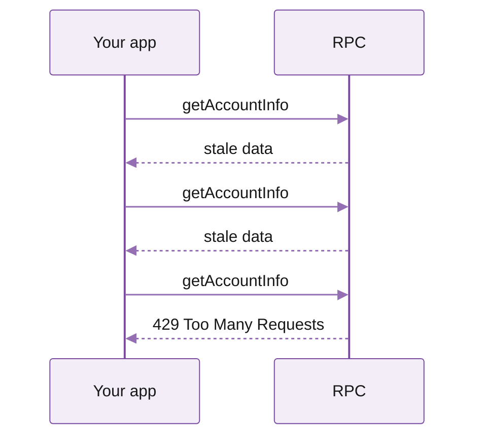
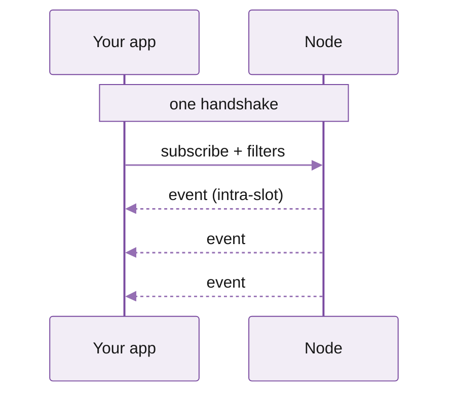

# Real-time streaming

Solana produces a new block every \~400 ms. If you poll RPC every 200 ms, your data is at best 200 ms stale by the time you see it, and you'll easily hit rate limits hammering the same endpoint.

Streaming inverts the model: you open one connection, say what you need (specific accounts, programs, or transactions), and the node pushes you matching events the instant they happen.











You get sub-slot latency, structured Protobuf payloads, and lower costs, also significantly cheaper than the equivalent polling traffic, as it only incurs bandwidth cost.

For teams with heavy polling codebases, Yellowstone Accounts Sync delivers streaming-grade reads through a one-line SDK swap.

## Triton streaming stack

Triton was first to ship gRPC streaming on Solana with **Yellowstone gRPC**, the open-source Geyser plugin that most of the ecosystem now runs on. Self-hosting is great for MVPs. At production scale, running on Triton gives you:

* **Dedicated streaming clusters.** Specialised infrastructure that doesn't serve general RPC traffic, tuned for the I/O profile of pushing events to thousands of subscribers.
* **Co-located with high-stake validators.** Streaming clusters sit next to high-stake validators in top-tier data centres and ingest shreds from our own validators, Jito, DoubleZero, and Turbine, so updates hit the edge as fast as physically possible.
* **Globally distributed across 20+ points of presence.** GeoDNS routes you to the nearest cluster; automatic failover handles outages.
* **Isolated services.** All the streaming services (Whirligig, Fumarole, Superbank) run on modular infrastructure, so a spike in one can't degrade the others.

## Pick your stream

Three things matter in streaming: **latency, reliability, and replay**. Years of running Yellowstone at scale taught us that no single product leads on all of them. So we built one for each, all on the Yellowstone Geyser foundation.

* Dragon's Mouth is the source of truth for live data, with Deshred giving you pre-execution transaction data on the same gRPC service.
* Whirligig translates Dragon's Mouth output into standard Solana WebSocket messages for browsers.
* Fumarole consumes multiple Dragon's Mouth nodes, deduplicates, and persists a cursor on the server side so you can resume exactly where you left off after disconnects.
* Superbank taps the historical archive but uses the same gRPC interface, so the live and historical pipelines appear identical to your client code.

| Capability                 | Dragon's Mouth | Deshred tx | Whirligig websocket |         Fumarole        |   Superbank   |
| -------------------------- | :------------: | :--------: | :-----------------: | :---------------------: | :-----------: |
| Real-time data             |        ✓       |      ✓     |          ✓          |            ✓            |       ✗       |
| Pre-execution transactions |        ✗       |      ✓     |          ✗          |            ✗            |       ✗       |
| Historical replay          |        ✗       |      ✗     |          ✗          |          4 days         | Entire ledger |
| Persistent cursor          |        ✗       |      ✗     |          ✗          |            ✓            |   slot range  |
| Browser-compatible         |        ✗       |      ✗     |          ✓          |            ✗            |       ✗       |
| Commitment                 |       all      |      ✗     |         all         | all (confirmed latency) |   finalised   |
| Protocol                   |      gRPC      |    gRPC    |      WebSocket      |           gRPC          |      gRPC     |

It's normal to combine more than one product in a pipeline. Common patterns:

* **Trading and MEV**: Dragon's Mouth gRPC for processed data, Deshred for pre-execution tx
* **DEX or wallet frontend**: Whirligig WebSockets
* **Indexer, analytics, or compliance**: Fumarole for reliable, persistent data with automatic backfill

<table data-card-size="large" data-view="cards"><thead><tr><th></th><th></th><th data-hidden data-card-target data-type="content-ref"></th></tr></thead><tbody><tr><td><i class="fa-radio">:radio:</i> <strong>Dragon's Mouth gRPC</strong></td><td>Sub-slot real-time updates for accounts, transactions, slots, and blocks via gRPC.</td><td><a href="https://app.gitbook.com/s/Xz3Ki4zincxsnRG91NNt/solana/real-time-streaming/dragon-s-mouth-grpc">Dragon's Mouth gRPC</a></td></tr><tr><td><i class="fa-fire">:fire:</i> <strong>Deshred transactions</strong></td><td>Pre-execution transactions reconstructed from raw shreds. Earliest intent signal for traders.</td><td><a href="https://app.gitbook.com/s/Xz3Ki4zincxsnRG91NNt/solana/real-time-streaming/deshred-transactions">Deshred transactions</a></td></tr><tr><td><i class="fa-rotate-right">:rotate-right:</i> <strong>Whirligig WebSockets</strong></td><td>Drop-in for native Solana WebSockets. Fastest real-time data for frontends, backed by gRPC.</td><td><a href="https://app.gitbook.com/s/Xz3Ki4zincxsnRG91NNt/solana/real-time-streaming/whirligig-websockets">Whirligig WebSockets</a></td></tr><tr><td><i class="fa-layer-group">:layer-group:</i> <strong>Fumarole reliable streams</strong></td><td>Redundant streaming layer with 4 days of stored data and built-in cursor resume.</td><td><a href="https://app.gitbook.com/s/Xz3Ki4zincxsnRG91NNt/solana/real-time-streaming/fumarole-persistent-streams">Fumarole reliable streams</a></td></tr></tbody></table>

## Limitations

Light Protocol program is excluded from all our streams and is also unavailable via `getProgramAccounts`. At peak load, it accounted for over 50% of all Geyser traffic, making it impractical to include in standard streams

| Program                         | Address                                       |
| ------------------------------- | --------------------------------------------- |
| Light Protocol / ZK Compression | `compr6CUsB5m2jS4Y3831ztGSTnDpnKJTKS95d64XVq` |

## Pricing

All streaming services are billed at `$0.08 / GB` of bandwidth, and you only pay for the data sent. See streaming best practices for filtering, guides, and other ways to reduce it.

## What's next

<table data-card-size="large" data-view="cards"><thead><tr><th></th><th></th><th data-hidden data-card-target data-type="content-ref"></th></tr></thead><tbody><tr><td><i class="fa-play">:play:</i> <strong>Streaming quickstart</strong></td><td>Test every Triton streaming service in under five minutes.</td><td><a href="https://app.gitbook.com/s/Xz3Ki4zincxsnRG91NNt/solana/real-time-streaming/quickstart">https://app.gitbook.com/s/Xz3Ki4zincxsnRG91NNt/solana/real-time-streaming/quickstart</a></td></tr><tr><td><i class="fa-arrows-rotate">:arrows-rotate:</i> <strong>Account Sync</strong></td><td>Streaming-backed local cache for account reads. No polling, no code changes.</td><td><a href="https://app.gitbook.com/s/Xz3Ki4zincxsnRG91NNt/solana/reading-account-state/account-sync">https://app.gitbook.com/s/Xz3Ki4zincxsnRG91NNt/solana/reading-account-state/account-sync</a></td></tr></tbody></table>

***

<i class="fa-life-ring">:life-ring:</i> Contact support by clicking the chat icon in your [customer dashboard](https://customers.triton.one)\
<i class="fa-briefcase">:briefcase:</i> Sales questions? [Contact us](https://triton.one/contact)\
<i class="fa-sparkles">:sparkles:</i> AI agent? Read [llms.txt](https://docs.triton.one/llms.txt)\
<i class="fa-rss">:rss:</i> Follow updates: [Blog](https://blog.triton.one) · [X](https://x.com/triton_one) · [YouTube](https://www.youtube.com/@triton_one_ltd) · [Telegram](https://t.me/tritonone) · [GitHub](https://github.com/rpcpool)
