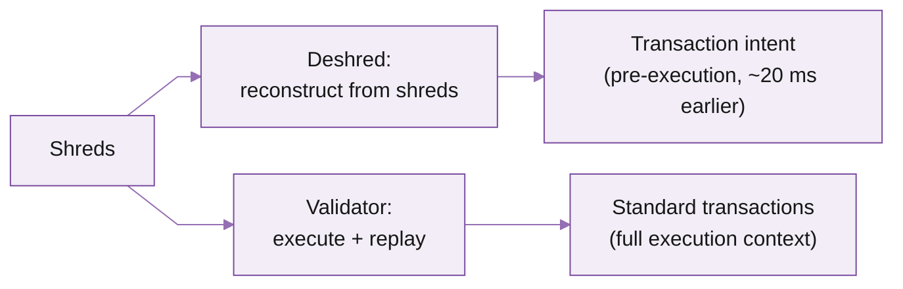

# Deshred transactions

Pre-execution transaction stream reconstructed from shreds, before the validator executes them. The earliest usable on-chain signal exposed by Yellowstone gRPC.

## What is Deshred

Deshred is a separate gRPC method (`SubscribeDeshred`) on the same yellowstone-grpc service as Dragon's Mouth. It delivers transactions reconstructed from shreds **before** the validator executes them.

This is the earliest usable on-chain signal Triton exposes. It's designed for latency-sensitive systems that care about transaction intent as early as possible: arbitrage, market making, copy trading, liquidations, HFT.

Unlike the standard `Subscribe` transaction stream, deshred updates are emitted **before** Replay. You receive the decoded transaction earlier, but without execution context.



## Features and benefits

<table data-card-size="large" data-view="cards"><thead><tr><th></th><th></th><th data-hidden data-card-target data-type="content-ref"></th></tr></thead><tbody><tr><td><i class="fa-eye">:eye:</i> <strong>Earliest signal</strong></td><td>Pre-execution stream from raw shreds. ~20ms ahead at p75 vs confirmed transactions.</td><td></td></tr><tr><td><i class="fa-code-fork">:code-fork:</i> <strong>Same gRPC service</strong></td><td>Drops into your existing Dragon's Mouth pipeline. Separate method, same client.</td><td></td></tr><tr><td><i class="fa-tags">:tags:</i> <strong>Resolved ALT addresses</strong></td><td>Includes writable and readonly addresses resolved from Address Lookup Tables.</td><td></td></tr></tbody></table>

## Use cases

Deshred is for strategies that act on the earliest possible signal, before execution:

* **HFT and arbitrage** that react to transaction intent the moment entries form from shreds.
* **MEV and market making** that need the earliest view of price-impacting transactions.
* **Copy-trading and liquidations** that follow specific accounts as soon as they act.

**What not to use it for.** If you need execution results (status, balance changes, logs) or any confirmation guarantee, use the [Dragon's Mouth](dragon-s-mouth-grpc) `transactions` stream instead, or run it in parallel and join on `signature`. Deshred is intent-only and pre-execution: a transaction may fail, land on a dead fork, or never confirm.

## Filter configuration

`SubscribeDeshred` supports four filter fields, combined as logical AND:

| Parameter          | Type       | Required | Description                                                                      |
| ------------------ | ---------- | -------- | -------------------------------------------------------------------------------- |
| `vote`             | `bool`     | No       | Include or exclude vote transactions. `false` excludes votes.                    |
| `account_include`  | `string[]` | No       | Accounts mentioned anywhere in the transaction (including loaded ALT addresses). |
| `account_exclude`  | `string[]` | No       | Exclude transactions mentioning any of these accounts.                           |
| `account_required` | `string[]` | Yes      | Accounts that MUST all be mentioned (every one of them).                         |

## Subscribe and consume

Before you start, make sure you have:

* An active Triton subscription
* Your endpoint URL and secret token from the [customer dashboard](https://customers.triton.one/) (how to get them)
* A backend environment in TypeScript, Rust, Go, or another language with a gRPC client
* Familiarity with gRPC and Protocol Buffers

The latest protobuf files live in the [yellowstone-grpc repo](https://github.com/rpcpool/yellowstone-grpc/tree/master/yellowstone-grpc-proto/proto). For Rust, use the [yellowstone-grpc-proto crate](https://crates.io/crates/yellowstone-grpc-proto).

The example below subscribes to the `SubscribeDeshred` stream, filters out vote transactions, and logs every transaction signature with its slot.



```typescript

  SubscribeDeshredRequest,
} from "@triton-one/yellowstone-grpc";

const client = new Client(
  "https://<your-endpoint>.mainnet.rpcpool.com",
  "<your-token>",
  undefined
);

const stream = await client.subscribeDeshred();

stream.on("data", (data) => {
  console.log("data", data);
});

const request: SubscribeDeshredRequest = {
  deshredTransactions: {
    client: {
      vote: false,
      accountInclude: [],
      accountExclude: [],
      accountRequired: [],
    },
  },
  ping: undefined,
};

await new Promise<void>((resolve, reject) => {
  stream.write(request, (err) =>
    err ? reject(err) : resolve()
  );
});
```



```rust
use {
    futures::{sink::SinkExt, stream::StreamExt},
    solana_signature::Signature,
    std::collections::HashMap,
    tonic::transport::channel::ClientTlsConfig,
    yellowstone_grpc_client::GeyserGrpcClient,
    yellowstone_grpc_proto::prelude::{
        subscribe_update_deshred::UpdateOneof, SubscribeDeshredRequest,
        SubscribeRequestFilterDeshredTransactions, SubscribeRequestPing,
    },
};

#[tokio::main]
async fn main() -> anyhow::Result<()> {
    let endpoint = std::env::var("ENDPOINT")
        .unwrap_or("https://<endpoint>".into());
    let x_token = std::env::var("X_TOKEN").ok();

    let mut client = GeyserGrpcClient::build_from_shared(endpoint)?
        .x_token(x_token)?
        .tls_config(ClientTlsConfig::new().with_native_roots())?
        .http2_adaptive_window(true)
        .initial_connection_window_size(8 * 1024 * 1024) // 8 MiB
        .initial_stream_window_size(4 * 1024 * 1024) // 4 MiB
        .connect()
        .await?;

    let request = SubscribeDeshredRequest {
        deshred_transactions: HashMap::from([(
            "deshred".into(),
            SubscribeRequestFilterDeshredTransactions {
                vote: Some(false),
                account_include: vec![],
                account_exclude: vec![],
                account_required: vec![],
            },
        )]),
        ping: None,
    };

    let (mut tx, mut stream) =
        client.subscribe_deshred_with_request(Some(request)).await?;

    while let Some(msg) = stream.next().await {
        match msg?.update_oneof {
            Some(UpdateOneof::DeshredTransaction(update)) => {
                let info = update.transaction.as_ref().unwrap();
                let sig = Signature::try_from(info.signature.as_slice())?;
                println!("slot={} sig={sig} vote={}", update.slot, info.is_vote);
            }
            Some(UpdateOneof::Ping(_)) => {
                tx.send(SubscribeDeshredRequest {
                    ping: Some(SubscribeRequestPing { id: 1 }),
                    ..Default::default()
                }).await?;
            }
            Some(UpdateOneof::Pong(_)) => {}
            None => break,
        }
    }

    Ok(())
}
```



## Response payload example

A deshred update is a `SubscribeUpdateDeshred` containing a single transaction reconstructed from shreds:

```json
{
  "slot": 275123456,
  "transaction": {
    "signature": "5j7s4Hk3QmZ9xT2pK8nLm9VbY3wQ8aRf6dGjXwE5pN1",
    "is_vote": false,
    "transaction": {
      "signatures": ["5j7s4Hk3..."],
      "message": {
        "header": { "...": "..." },
        "account_keys": ["...", "..."],
        "recent_blockhash": "GpJjHvT...",
        "instructions": [{ "...": "..." }]
      }
    },
    "loaded_writable_addresses": [
      "TokenkegQfeZyiNwAJbNbGKPFXCWuBvf9Ss623VQ5DA"
    ],
    "loaded_readonly_addresses": []
  }
}
```

The `loaded_writable_addresses` and `loaded_readonly_addresses` fields contain addresses resolved from Address Lookup Tables (ALTs), so deshred filters match both static account keys and dynamically loaded addresses.

## Limitations

Deshred carries the raw transaction only, captured before execution, so what it returns differs from the standard `transactions` stream:

| What you get | Standard transactions (Dragon's Mouth) | Deshred |
| --- | --- | --- |
| Timing | After execution and replay | Pre-execution, from shreds (~20 ms earlier at p75) |
| Transaction | Full transaction | Full transaction |
| ALT addresses | Resolved | Resolved (writable and readonly) |
| Execution context | Full: status, balance changes, inner instructions, logs, compute units | None: intent only |
| Confirmation or finality | Yes | None: a transaction may fail, fork off, or never confirm |

If your pipeline needs status, logs, or balance deltas, run a parallel Dragon's Mouth `transactions` subscription and join on `signature`.

For a deeper overview of architecture and tradeoffs, see [Deshred transactions: the fastest path to Solana data](https://blog.triton.one/deshred-transactions-the-fastest-path-to-solana-data/).

## What's next?

<table data-card-size="large" data-view="cards"><thead><tr><th></th><th></th><th data-hidden data-card-target data-type="content-ref"></th></tr></thead><tbody><tr><td><i class="fa-radio">:radio:</i> <strong>Dragon's Mouth gRPC</strong></td><td>Sub-slot real-time updates for accounts, transactions, slots, and blocks via gRPC.</td><td><a href="https://kate-6.gitbook.io/triton-one-docs-v5/documentation/solana/real-time-streaming/dragon-s-mouth-grpc">Dragon's Mouth gRPC</a></td></tr><tr><td><i class="fa-newspaper">:newspaper:</i> <strong>Deshred blog post</strong></td><td>Architecture, tradeoffs, and how Deshred fits the Solana shred pipeline.</td><td><a href="https://blog.triton.one/deshred-transactions-the-fastest-path-to-solana-data/">https://blog.triton.one/deshred-transactions-the-fastest-path-to-solana-data/</a></td></tr></tbody></table>

***

<i class="fa-life-ring">:life-ring:</i> Contact support by clicking the chat icon in your [customer dashboard](https://customers.triton.one)\
<i class="fa-briefcase">:briefcase:</i> Sales questions? [Contact us](https://triton.one/contact)\
<i class="fa-sparkles">:sparkles:</i> AI agent? Read [llms.txt](https://docs.triton.one/llms.txt)\
<i class="fa-rss">:rss:</i> Follow updates: [Blog](https://blog.triton.one) · [X](https://x.com/triton_one) · [YouTube](https://www.youtube.com/@triton_one_ltd) · [Telegram](https://t.me/tritonone) · [GitHub](https://github.com/rpcpool)
