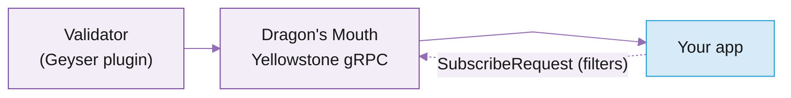
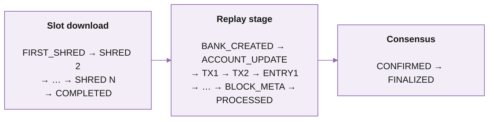

# Dragon's Mouth gRPC

Dragon's Mouth (or Yellowstone gRPC) taps the validator's Geyser plugin directly, so you get account, transaction, slot, and block updates as the validator processes them, giving you up to a 400 ms head start over a polling client.

## Use cases

It's the fastest live data path available for `processed` events and the recommended choice for any backend service where latency matters.

* **Trading, MEV, market making, and bots.** Lowest-latency reads of pool state, oracles, AMM accounts, and price-impacting transactions.
* **DeFi backends.** Live pool, order-book, and account state for services that react to the chain in real time.
* **Real-time UIs (backend).** Live balances, transaction feeds, and account state for backends that proxy to wallets and explorers.

When not to use it:

* Browsers and frontends cannot speak gRPC, so you should use [Whirligig WebSocket](https://app.gitbook.com/s/Xz3Ki4zincxsnRG91NNt/solana/real-time-streaming/whirligig-websockets) instead.
* If your pipeline cannot miss a block (indexing, analytics, compliance), use [Fumarole](https://app.gitbook.com/s/Xz3Ki4zincxsnRG91NNt/solana/real-time-streaming/fumarole-persistent-streams), which guarantees at-least-once delivery and auto-backfills up to 4 days of data on reconnect.

## Features and benefits

<table data-card-size="large" data-view="cards"><thead><tr><th></th><th></th><th data-hidden data-card-target data-type="content-ref"></th></tr></thead><tbody><tr><td><i class="fa-timer">:timer:</i> <strong>Sub-slot latency</strong></td><td>Intra-slot updates arrive ~400 ms ahead of standard RPC, which only emits at slot boundaries.</td><td></td></tr><tr><td><i class="fa-filter">:filter:</i> <strong>Server-side filtering</strong></td><td>Filter by pubkey, program owner, signature, memcmp, datasize, or token-account state, all server-side.</td><td></td></tr><tr><td><i class="fa-right-left">:right-left:</i> <strong>Bi-directional streams</strong></td><td>Modify subscriptions on the fly without reconnecting. Send a new request, server swaps your filter set.</td><td></td></tr><tr><td><i class="fa-feather">:feather:</i> <strong>Compact Protobuf payloads</strong></td><td>Binary serialisation cuts bandwidth and CPU. Cheaper to stream, faster to parse.</td><td></td></tr><tr><td><i class="fa-compress">:compress:</i> <strong>Compressed account filters</strong></td><td>Track millions of accounts with a Cuckoo-filter set instead of a raw pubkey list, cutting subscription payloads ~10x.</td><td></td></tr><tr><td><i class="fa-arrows-rotate">:arrows-rotate:</i> <strong>Auto-reconnect and backfill</strong></td><td>The Rust and TS clients automatically reconnect, replay from your last completed slot (up to ~1,000 slots), and dedup the replay window.</td><td></td></tr></tbody></table>

## How it works

Dragon's Mouth taps the validator's Geyser plugin, so updates are pushed the moment the node processes them instead of waiting on a polling loop. You open a gRPC stream, send a `SubscribeRequest` describing the accounts, transactions, slots, blocks, or entries you want, and matching updates arrive as protobuf messages at your chosen commitment level (`processed`, `confirmed`, or `finalized`). The same stream accepts updated requests, the service answers one-shot unary calls, and on reconnect you can replay from a recent slot so a brief disconnect costs you nothing.



## Supported methods

Dragon's Mouth exposes two interfaces on the same gRPC service: streaming subscriptions (via the `Subscribe` method, plus the separate `SubscribeDeshred`) and one-shot unary calls you can use for occasional queries.



| Stream               | What you receive                                                                                                         |
| -------------------- | ------------------------------------------------------------------------------------------------------------------------ |
| Account writes       | Updates whenever a matching account's data, lamports, or owner changes                                                   |
| Transactions         | Every transaction matching your filter, with full `meta` (logs, status, balance deltas)                                  |
| Deshred Transactions gRPC | Transactions reconstructed from shreds _before_ execution. Separate `SubscribeDeshred` method. See Deshred Transactions gRPC. |
| Entries              | Solana ledger entries (low-level, rare use case)                                                                         |
| Block notifications  | Full blocks as they're produced, optionally with their transactions and accounts                                         |
| Block metadata       | Block headers only, without the transaction payload                                                                      |
| Slot notifications   | Slot-status events (processed/confirmed/finalized plus intra-slot lifecycle)                                             |



| Method | Returns |
| --- | --- |
| `getLatestBlockhash`  | The latest blockhash + last valid block height at a commitment level |
| `getBlockHeight`      | The current block height at a commitment level |
| `getSlot`             | The current slot at a commitment level |
| `isValidBlockhash`    | Whether a given blockhash is still valid |
| `subscribeReplayInfo` | Earliest slot still available for stream replay |
| `getVersion`          | The Geyser gRPC plugin and Solana version |
| `ping`                | Liveness check; the server replies with a `pong` |



## Subscribe request

Every stream subscription is a single `SubscribeRequest` message. It has fields that apply across all stream types and a per-stream filter map.

You send it once when you open the stream; then you can send it again at any time to modify it (the new request fully replaces the old one).



Commitment level for buffering. Optional. Defaults to `processed`.

| Value           | Meaning                                                |
| --------------- | ------------------------------------------------------ |
| `PROCESSED` (0) | Highest slot seen, possibly on a fork. Lowest latency. |
| `CONFIRMED` (1) | Voted on by supermajority. Some buffering.             |
| `FINALIZED` (2) | Max vote lockout. Most buffering.                      |

For maximum performance, work at `processed` and manage commitment client-side by subscribing to [slot notifications](https://app.gitbook.com/s/Xz3Ki4zincxsnRG91NNt/solana/real-time-streaming/dragon-s-mouth-grpc) alongside your data. The pattern:

1. Subscribe to slot notifications alongside your data stream.
2. Buffer incoming events by slot.
3. When you see a slot status change to `confirmed` or `finalized`, release the matching buffer.
4. You'll always receive the slot's events _before_ its commitment notification.


**Not every finalized slot notification is issued.** Because of a Geyser quirk (fixed in Solana `master`), some `finalized` slot notifications are never sent. To handle finalized correctly, whenever you receive a `finalized` slot notification, retroactively mark its ancestor slots as finalized too, even if you never got a notification for them.




Sends a periodic keepalive to prevent idle-stream drops by upstream cloud providers (e.g. Cloudflare). Server replies with `pong`. Optional but recommended for long-running streams.

See [pings](https://app.gitbook.com/s/Xz3Ki4zincxsnRG91NNt/solana/real-time-streaming/dragon-s-mouth-grpc).



Truncates account data payloads to a byte range, reducing bandwidth. Optional. Empty array means full payload.

Example: `[{ "offset": 32, "length": 40 }]` returns 40 bytes starting at byte 32.



Replay buffered updates starting from this slot, then continue live on the same stream. Optional. Used for reconnection after short disconnections.

See [replay from a slot](https://app.gitbook.com/s/Xz3Ki4zincxsnRG91NNt/solana/real-time-streaming/dragon-s-mouth-grpc).



### Multiplexing in one connection

A single gRPC connection can carry many subscriptions. Add multiple named entries to any of the filter maps (`accounts`, `transactions`, `slots`, `blocks`, `blocksMeta`, `entry`) and they all stream over the same connection. Each match is tagged with the filter name(s) that produced it, so you can route updates downstream without splitting connections.

The canonical multiplex example is the [Multiple programs Accounts subscription](https://app.gitbook.com/s/Xz3Ki4zincxsnRG91NNt/solana/real-time-streaming/dragon-s-mouth-grpc), two named owner filters under `accounts`, one connection. The same pattern works across stream types: subscribe to accounts AND transactions AND slots in one request.

### Filter configuration

Each `SubscribeRequest` has a map per stream type. The key is a label you choose (returned with each match so you can route it); the value is the filter spec.

<details>

<summary>Account filters</summary>

| Parameter | Type               | Required | Description                                                                                                                                          |
| --------- | ------------------ | -------- | ---------------------------------------------------------------------------------------------------------------------------------------------------- |
| `account` | `string[]`         | -        | List of pubkeys to subscribe to directly. Each must be a base58-encoded address.                                                                     |
| `owner`   | `string[]`         | -        | List of program owners. Subscribes to every account owned by these programs.                                                                         |
| `filters` | `AccountsFilter[]` | -        | Content-based filters on the account data. Each filter is one of: `memcmp`, `datasize`, `tokenAccountState`, or `lamports`. Combined as logical AND. |

</details>

<details>

<summary>Transaction filters</summary>

| Parameter          | Type       | Required | Description                                                        |
| ------------------ | ---------- | -------- | ------------------------------------------------------------------ |
| `vote`             | `bool`     | -        | Include or exclude vote transactions. `false` excludes votes.      |
| `failed`           | `bool`     | -        | Include or exclude failed transactions. `false` excludes failures. |
| `signature`        | `string`   | -        | Subscribe to a specific signature's status updates.                |
| `account_include`  | `string[]` | -        | Accounts mentioned anywhere in the transaction.                    |
| `account_exclude`  | `string[]` | -        | Exclude transactions mentioning these accounts.                    |
| `account_required` | `string[]` | Yes      | Accounts that MUST all be mentioned (every one of them).           |

</details>

<details>

<summary>Block filters</summary>

| Parameter              | Type       | Required | Description                                                             |
| ---------------------- | ---------- | -------- | ----------------------------------------------------------------------- |
| `account_include`      | `string[]` | -        | Only deliver transactions and accounts in the block that mention these. |
| `include_transactions` | `bool`     | -        | Include the block's transactions.                                       |
| `include_accounts`     | `bool`     | -        | Include accounts updated during the block.                              |
| `include_entries`      | `bool`     | -        | Include the block's entries.                                            |

</details>

<details>

<summary>Slot filters</summary>

| Parameter              | Type   | Required | Description                                                                                                   |
| ---------------------- | ------ | -------- | ------------------------------------------------------------------------------------------------------------- |
| `filter_by_commitment` | `bool` | -        | If `true`, only receive updates matching the request's `commitment`. If `false`, receive every status change. |

</details>

### Filter logic

Within a single filter category (e.g. one transaction filter), values are combined as follows:

* **Within an array, OR.** `account_include: [A, B]` matches transactions mentioning A _or_ B.
* **Across fields, AND.** `vote: false, account_include: [A]` matches non-vote transactions mentioning A.

For transactions specifically:

```
match = (accountInclude OR empty) AND (accountRequired AND all) AND NOT accountExclude
```

Across multiple named filters in the same category (e.g. two transaction filters), you receive matches from any of them. Each match comes tagged with the filter name(s) that produced it, so you can route updates downstream.

## Subscribing to each stream type

Before you start, make sure you have:

* An active Triton subscription
* Your endpoint URL and secret token from the [customer dashboard](https://customers.triton.one/) (how to get them)
* A backend environment in TypeScript, Rust, Go, or another language with a gRPC client
* Familiarity with gRPC and Protocol Buffers

The latest protobuf files live in the [yellowstone-grpc repo](https://github.com/rpcpool/yellowstone-grpc/tree/master/yellowstone-grpc-proto/proto). For Rust, use the [yellowstone-grpc-proto crate](https://crates.io/crates/yellowstone-grpc-proto).

The examples below use gRPC JSON for the request body and TypeScript for the client. Other languages use the same shape. Each example assumes you've already created and connected a `Client` (see [clients and SDKs](https://app.gitbook.com/s/Xz3Ki4zincxsnRG91NNt/solana/real-time-streaming/dragon-s-mouth-grpc)).

### Accounts



Subscribe to one or more specific accounts. The label `wsol/usdc` is yours, it comes back on each match for routing.



```json
{
  "slots": { "slots": {} },
  "accounts": {
    "wsol/usdc": {
      "account": ["8BnEgHoWFysVcuFFX7QztDmzuH8r5ZFvyP3sYwn1XTh6"]
    }
  },
  "transactions": {},
  "blocks": {},
  "blocks_meta": {},
  "accounts_data_slice": [],
  "commitment": 1
}
```



```typescript
import { CommitmentLevel } from "@triton-one/yellowstone-grpc";

const request = {
  slots: { slots: {} },
  accounts: {
    "wsol/usdc": {
      account: ["8BnEgHoWFysVcuFFX7QztDmzuH8r5ZFvyP3sYwn1XTh6"],
    },
  },
  transactions: {},
  blocks: {},
  blocksMeta: {},
  accountsDataSlice: [],
  commitment: CommitmentLevel.CONFIRMED,
};
```



```rust
use {
    std::collections::HashMap,
    yellowstone_grpc_proto::prelude::{
        CommitmentLevel, SubscribeRequest, SubscribeRequestFilterAccounts,
        SubscribeRequestFilterSlots,
    },
};

let mut accounts = HashMap::new();
accounts.insert(
    "wsol/usdc".to_string(),
    SubscribeRequestFilterAccounts {
        account: vec!["8BnEgHoWFysVcuFFX7QztDmzuH8r5ZFvyP3sYwn1XTh6".to_string()],
        owner: vec![],
        filters: vec![],
        ..Default::default()
    },
);

let mut slots = HashMap::new();
slots.insert("client".to_string(), SubscribeRequestFilterSlots::default());

let request = SubscribeRequest {
    accounts,
    slots,
    commitment: Some(CommitmentLevel::Confirmed.into()),
    ..Default::default()
};
```





Subscribe to every account owned by a program. The example tracks all Solend accounts.



```json
{
  "slots": { "slots": {} },
  "accounts": {
    "solend": {
      "owner": ["So1endDq2YkqhipRh3WViPa8hdiSpxWy6z3Z6tMCpAo"]
    }
  },
  "transactions": {},
  "blocks": {},
  "blocks_meta": {},
  "accounts_data_slice": [],
  "commitment": 0
}
```



```typescript
import { CommitmentLevel } from "@triton-one/yellowstone-grpc";

const request = {
  slots: { slots: {} },
  accounts: {
    solend: {
      owner: ["So1endDq2YkqhipRh3WViPa8hdiSpxWy6z3Z6tMCpAo"],
    },
  },
  transactions: {},
  blocks: {},
  blocksMeta: {},
  accountsDataSlice: [],
  commitment: CommitmentLevel.PROCESSED,
};
```



```rust
use {
    std::collections::HashMap,
    yellowstone_grpc_proto::prelude::{
        CommitmentLevel, SubscribeRequest, SubscribeRequestFilterAccounts,
        SubscribeRequestFilterSlots,
    },
};

let mut accounts = HashMap::new();
accounts.insert(
    "solend".to_string(),
    SubscribeRequestFilterAccounts {
        account: vec![],
        owner: vec!["So1endDq2YkqhipRh3WViPa8hdiSpxWy6z3Z6tMCpAo".to_string()],
        filters: vec![],
        ..Default::default()
    },
);

let mut slots = HashMap::new();
slots.insert("client".to_string(), SubscribeRequestFilterSlots::default());

let request = SubscribeRequest {
    accounts,
    slots,
    commitment: Some(CommitmentLevel::Processed.into()),
    ..Default::default()
};
```





Combine multiple programs in one filter, or use separate filters for different routing tags.

Both programs in one filter:

```json
{
  "slots": { "slots": {} },
  "accounts": {
    "programs": {
      "owner": [
        "So1endDq2YkqhipRh3WViPa8hdiSpxWy6z3Z6tMCpAo",
        "9xQeWvG816bUx9EPjHmaT23yvVM2ZWbrrpZb9PusVFin"
      ]
    }
  },
  "transactions": {},
  "blocks": {},
  "blocks_meta": {},
  "accounts_data_slice": []
}
```

Separate filters with different tags:

```json
{
  "slots": { "slots": {} },
  "accounts": {
    "solend": { "owner": ["So1endDq2YkqhipRh3WViPa8hdiSpxWy6z3Z6tMCpAo"] },
    "serum":  { "owner": ["9xQeWvG816bUx9EPjHmaT23yvVM2ZWbrrpZb9PusVFin"] }
  },
  "transactions": {},
  "blocks": {},
  "blocks_meta": {},
  "accounts_data_slice": []
}
```



Filter by content (memcmp, token account state) and trim the returned payload to save bandwidth. The example tracks USDC token accounts and returns only 40 bytes starting at offset 32 (owner + lamports).



```json
{
  "accounts": {
    "usdc": {
      "owner": ["TokenkegQfeZyiNwAJbNbGKPFXCWuBvf9Ss623VQ5DA"],
      "filters": [
        { "token_account_state": true },
        {
          "memcmp": {
            "offset": 0,
            "data": { "base58": "EPjFWdd5AufqSSqeM2qN1xzybapC8G4wEGGkZwyTDt1v" }
          }
        }
      ]
    }
  },
  "accounts_data_slice": [{ "offset": 32, "length": 40 }]
}
```



```typescript
import { CommitmentLevel } from "@triton-one/yellowstone-grpc";

const request = {
  slots: {},
  accounts: {
    usdc: {
      owner: ["TokenkegQfeZyiNwAJbNbGKPFXCWuBvf9Ss623VQ5DA"],
      filters: [
        { tokenAccountState: true },
        {
          memcmp: {
            offset: 0,
            data: { base58: "EPjFWdd5AufqSSqeM2qN1xzybapC8G4wEGGkZwyTDt1v" },
          },
        },
      ],
    },
  },
  transactions: {},
  blocks: {},
  blocksMeta: {},
  entry: {},
  commitment: CommitmentLevel.CONFIRMED,
  accountsDataSlice: [{ offset: 32, length: 40 }],
};
```



```rust
use {
    std::collections::HashMap,
    yellowstone_grpc_proto::prelude::{
        subscribe_request_filter_accounts_filter::Filter,
        subscribe_request_filter_accounts_filter_memcmp::Data,
        CommitmentLevel, SubscribeRequest, SubscribeRequestAccountsDataSlice,
        SubscribeRequestFilterAccounts, SubscribeRequestFilterAccountsFilter,
        SubscribeRequestFilterAccountsFilterMemcmp,
    },
};

let mut accounts = HashMap::new();
accounts.insert(
    "usdc".to_string(),
    SubscribeRequestFilterAccounts {
        account: vec![],
        owner: vec!["TokenkegQfeZyiNwAJbNbGKPFXCWuBvf9Ss623VQ5DA".to_string()],
        filters: vec![
            SubscribeRequestFilterAccountsFilter {
                filter: Some(Filter::TokenAccountState(true)),
            },
            SubscribeRequestFilterAccountsFilter {
                filter: Some(Filter::Memcmp(SubscribeRequestFilterAccountsFilterMemcmp {
                    offset: 0,
                    data: Some(Data::Base58(
                        "EPjFWdd5AufqSSqeM2qN1xzybapC8G4wEGGkZwyTDt1v".to_string(),
                    )),
                })),
            },
        ],
        ..Default::default()
    },
);

let request = SubscribeRequest {
    accounts,
    accounts_data_slice: vec![SubscribeRequestAccountsDataSlice {
        offset: 32,
        length: 40,
    }],
    commitment: Some(CommitmentLevel::Confirmed.into()),
    ..Default::default()
};
```





For subscriptions tracking thousands of accounts, the explicit pubkey list dominates the payload (1M pubkeys = \~44 MB per resend). Compressed account filters carry your tracked set as a [Cuckoo filter](https://en.wikipedia.org/wiki/Cuckoo_filter), a probabilistic data structure storing small fingerprints instead of full 32-byte pubkeys, cutting payload size \~10x.

| Tracked accounts | Compressed filter | Explicit pubkey list |
| ---------------: | ----------------: | -------------------: |
|            1,000 |           \~4 KiB |              \~44 KB |
|           10,000 |          \~32 KiB |             \~440 KB |
|          100,000 |         \~256 KiB |             \~4.4 MB |
|        1,000,000 |           \~4 MiB |              \~44 MB |
|        2,000,000 |           \~8 MiB |              \~84 MB |

Inserts and removes on the filter are O(1), so account-set mutations skip a full filter rebuild. And because it uses SipHash-2-4, a TypeScript client and a Rust client emit identical filter bytes for the same pubkey set, so one tracked set works across languages and Rust compiler versions.

**Tradeoffs:**

* **False positives** stay under 1%. Your client should keep an exact tracked set and drop incoming updates whose pubkey isn't in it. A `HashSet` check is the standard pattern; the probabilistic part lives only on the wire.
* **One-time build cost.** A 2M-account filter takes \~390 ms on a release build. Every subsequent insert, remove, and resend is cheap.

Available in the Rust and TypeScript clients (TypeScript from `@triton-one/yellowstone-grpc` v5.0.9). The Rust API builds a `CompressedAccountFilterSet` and attaches it to your `SubscribeRequest`:

```rust
use yellowstone_grpc_proto::cuckoo::CompressedAccountFilterSet;

let mut accounts = CompressedAccountFilterSet::with_capacity(2_000_000)?;
for pk in my_tracked_pubkeys() {
    accounts.insert(*pk)?;
}

let mut req = SubscribeRequest::default();
accounts.insert_into_subscribe_request(&mut req, "tracked");
```

Mutate and resend when the set changes:

```rust
accounts.insert(new_pubkey)?;
accounts.remove(old_pubkey)?;
accounts.insert_into_subscribe_request(&mut req, "tracked");
```

Drop false positives against your local exact set:

```rust
if accounts.contains(&incoming_pubkey) {
    // one of your tracked accounts
}
```

Full deep-dive: [Compressed filters for Yellowstone gRPC](https://blog.triton.one/compressed-filters-for-yellowstone-grpc-track-millions-of-accounts-with-10x-less-overhead).



### Transactions

Use the `transactions` subscription to receive executed transactions at your chosen commitment level; `processed` delivers them as soon as the node processes them, while `confirmed` and `finalized` add latency. If you want the **earliest possible signal**, before execution, use [Deshred Transactions gRPC](https://app.gitbook.com/s/Xz3Ki4zincxsnRG91NNt/solana/real-time-streaming/deshred-transactions), a separate gRPC method on the same service that delivers transactions reconstructed from shreds **before** the node executes them.



Subscribe to every successful, non-vote transaction at finalized commitment.



```json
{
  "slots": { "slots": {} },
  "accounts": {},
  "transactions": {
    "alltxs": { "vote": false, "failed": false }
  },
  "blocks": {},
  "blocks_meta": {},
  "accounts_data_slice": [],
  "commitment": 2
}
```



```typescript
import { CommitmentLevel } from "@triton-one/yellowstone-grpc";

const request = {
  slots: { slots: {} },
  accounts: {},
  transactions: {
    alltxs: { vote: false, failed: false },
  },
  blocks: {},
  blocksMeta: {},
  accountsDataSlice: [],
  commitment: CommitmentLevel.FINALIZED,
};
```



```rust
use {
    std::collections::HashMap,
    yellowstone_grpc_proto::prelude::{
        CommitmentLevel, SubscribeRequest, SubscribeRequestFilterTransactions,
    },
};

let mut transactions = HashMap::new();
transactions.insert(
    "alltxs".to_string(),
    SubscribeRequestFilterTransactions {
        vote: Some(false),
        failed: Some(false),
        ..Default::default()
    },
);

let request = SubscribeRequest {
    transactions,
    commitment: Some(CommitmentLevel::Finalized.into()),
    ..Default::default()
};
```





Subscribe to non-vote transactions that mention a specific account anywhere.



```json
{
  "transactions": {
    "serum": {
      "vote": false,
      "account_include": ["9xQeWvG816bUx9EPjHmaT23yvVM2ZWbrrpZb9PusVFin"]
    }
  }
}
```





Drop transactions that mention any of the listed accounts.



```json
{
  "transactions": {
    "serum": {
      "account_exclude": [
        "9xQeWvG816bUx9EPjHmaT23yvVM2ZWbrrpZb9PusVFin",
        "TokenkegQfeZyiNwAJbNbGKPFXCWuBvf9Ss623VQ5DA"
      ]
    }
  }
}
```





Combine include + exclude in one filter. The example matches transactions mentioning a Serum program but excludes any that also touch a specific account.



```json
{
  "transactions": {
    "serum": {
      "account_include": ["9xQeWvG816bUx9EPjHmaT23yvVM2ZWbrrpZb9PusVFin"],
      "account_exclude": ["9wFFyRfZBsuAha4YcuxcXLKwMxJR43S7fPfQLusDBzvT"]
    }
  }
}
```





Track a specific transaction's lifecycle from confirmed to finalized.



```json
{
  "transactions": {
    "sign": {
      "signature": "5rp2hL9b6kexex11Mugfs3vfU9GhieKruj4CkFFSnu52WLxiGn4VcLLwsB62XURhMmT1j4CZiXT6FFtYbXsLq2Zs"
    }
  }
}
```





For the wire format of each transaction update, see [`geyser.proto`](https://github.com/rpcpool/yellowstone-grpc/blob/master/yellowstone-grpc-proto/proto/geyser.proto) (search for `SubscribeUpdateTransaction`).

### Slots

Subscribe to slot status changes. No filter parameters needed beyond a label.



```json
{
  "slots": { "incoming_slots": {} },
  "accounts": {},
  "transactions": {},
  "blocks": {},
  "blocks_meta": {},
  "accounts_data_slice": []
}
```



```rust
use {
    std::collections::HashMap,
    yellowstone_grpc_proto::prelude::{SubscribeRequest, SubscribeRequestFilterSlots},
};

let mut slots = HashMap::new();
slots.insert(
    "incoming_slots".to_string(),
    SubscribeRequestFilterSlots::default(),
);

let request = SubscribeRequest {
    slots,
    ..Default::default()
};
```



Each update carries a `SlotStatus` enum, see [intra-slot updates](https://app.gitbook.com/s/Xz3Ki4zincxsnRG91NNt/solana/real-time-streaming/dragon-s-mouth-grpc) for the full lifecycle.

### Blocks



Receive every block as it's produced, with full transaction payload.



```json
{
  "slots": {},
  "accounts": {},
  "transactions": {},
  "blocks": { "blocks": {} },
  "blocks_meta": {},
  "accounts_data_slice": []
}
```



```rust
use {
    std::collections::HashMap,
    yellowstone_grpc_proto::prelude::{SubscribeRequest, SubscribeRequestFilterBlocks},
};

let mut blocks = HashMap::new();
blocks.insert(
    "blocks".to_string(),
    SubscribeRequestFilterBlocks::default(),
);

let request = SubscribeRequest {
    blocks,
    ..Default::default()
};
```





Trim the block payload by toggling `include_transactions` / `include_accounts`.



```json
{
  "blocks": {
    "blocks": {
      "include_transactions": false,
      "include_accounts": true
    }
  }
}
```





Restrict the block's transactions and accounts to those mentioning specific addresses.



```json
{
  "blocks": {
    "blocks": {
      "account_include": ["So1endDq2YkqhipRh3WViPa8hdiSpxWy6z3Z6tMCpAo"]
    }
  }
}
```





Get block headers without the transaction payload (much smaller messages).



```json
{
  "blocks": {},
  "blocks_meta": { "blockmetadata": {} }
}
```





### Entries

Subscribe to ledger entries (groups of transactions that make up a slot). No filters; subscribe by adding any named entry filter.



```json
{
  "entry": { "all": {} }
}
```



```rust
use {
    std::collections::HashMap,
    yellowstone_grpc_proto::prelude::{SubscribeRequest, SubscribeRequestFilterEntry},
};

let mut entry = HashMap::new();
entry.insert("all".to_string(), SubscribeRequestFilterEntry::default());

let request = SubscribeRequest {
    entry,
    ..Default::default()
};
```



## Modifying and unsubscribing

The subscribe stream is bi-directional. Send a new `SubscribeRequest` at any time to update filters, it fully replaces the previous subscription, so your client must keep a local copy of the full config it wants.

To unsubscribe from everything but keep the connection open:



```json
{
  "slots": {},
  "accounts": {},
  "transactions": {},
  "blocks": {},
  "blocks_meta": {}
}
```



## Sending pings

Some cloud providers (e.g. Cloudflare) close idle streams. To avoid this, you need to keep sending pings to the server. The server responds with a `pong` message every 15 seconds.



```typescript
const PING_INTERVAL_MS = 30_000;

const pingRequest = {
  ping: { id: 1 },
  accounts: {},
  accountsDataSlice: [],
  transactions: {},
  transactionsStatus: {},
  blocks: {},
  blocksMeta: {},
  entry: {},
  slots: {},
};

setInterval(async () => {
  await new Promise<void>((resolve, reject) => {
    stream.write(pingRequest, (err) =>
      err ? reject(err) : resolve()
    );
  });
}, PING_INTERVAL_MS);

stream.on("data", (data) => {
  if (data.pong) {
    console.log("Received pong");
  }
});
```



```rust
use {
    crate::grpc::geyser::{
        SubscribeRequest, SubscribeRequestPing, geyser_client::GeyserClient,
        subscribe_update::UpdateOneof,
    },
    bytes::Bytes,
    tokio::sync::mpsc,
    tokio_stream::{StreamExt, wrappers::ReceiverStream},
    tonic::{
        metadata::{Ascii, MetadataValue},
        service::Interceptor,
        transport::{Channel, ClientTlsConfig},
    },
    tower::{ServiceBuilder, ServiceExt, util::BoxService},
};

const MAX_DECODING_MESSAGE_SIZE_BYTES: usize = 100_000_000; // 100 MB

#[derive(Clone)]
struct TritonAuthInterceptor {
    x_token: MetadataValue<Ascii>,
}

impl Interceptor for TritonAuthInterceptor {
    fn call(&mut self, request: tonic::Request<()>) -> Result<tonic::Request<()>, tonic::Status> {
        let mut request = request;
        let metadata = request.metadata_mut();
        metadata.insert("x-token", self.x_token.clone());
        Ok(request)
    }
}

pub type GeyserGrpcService = BoxService<
    hyper::Request<tonic::body::BoxBody>,
    hyper::Response<tonic::body::BoxBody>,
    tonic::transport::Error,
>;

pub async fn build_geyser_grpc_endpoint(
    endpoint: impl Into<Bytes>,
    x_token: Option<String>,
) -> anyhow::Result<GeyserClient<GeyserGrpcService>> {
    let tls_config = ClientTlsConfig::new().with_native_roots();
    let endpoint = Channel::from_shared(endpoint)?
        .tls_config(tls_config)?
        .connect_lazy();
    let svc = if let Some(x_token) = x_token {
        let metadata = x_token.try_into()?;
        let interceptor = TritonAuthInterceptor { x_token: metadata };
        ServiceBuilder::new()
            .layer(tonic::service::interceptor(interceptor))
            .service(endpoint)
            .boxed()
    } else {
        endpoint.boxed()
    };
    let client = GeyserClient::new(svc).max_decoding_message_size(MAX_DECODING_MESSAGE_SIZE_BYTES);
    Ok(client)
}

pub async fn build_geyser_blockchain_event_stream(
    endpoint: impl Into<Bytes> + Send + 'static,
    x_token: Option<String>,
    request: SubscribeRequest,
    tx: mpsc::Sender<UpdateOneof>,
) -> impl Future<Output = ()> {
    let mut geyser_client = build_geyser_grpc_endpoint(endpoint, x_token)
        .await
        .expect("failed to build geyser grpc endpoint");

    // Keep `subscribe_tx` alive to send ping requests to the geyser server.
    // Necessary to keep the connection alive for some proxy setups.
    let (subscribe_tx, subscribe_rx) = mpsc::channel(20000);
    subscribe_tx
        .send(request)
        .await
        .expect("failed to send subscribe request");

    let response = geyser_client
        .subscribe(ReceiverStream::new(subscribe_rx))
        .await
        .expect("failed to subscribe to geyser");
    let geyser_source = response.into_inner();

    async move {
        let tx = tx;
        let mut geyser_source = geyser_source;
        let mut ping_cnt: i32 = 0;
        loop {
            let result = geyser_source.next().await;
            match result {
                Some(event) => match event {
                    Ok(event) => {
                        let event = match event.update_oneof {
                            Some(value) => value,
                            None => continue,
                        };

                        let blockchain_event: Option<UpdateOneof> = match event {
                            // Answer Ping requests using `subscribe_tx`
                            UpdateOneof::Ping(_req) => {
                                if subscribe_tx
                                    .send(SubscribeRequest {
                                        ping: Some(SubscribeRequestPing { id: ping_cnt }),
                                        ..Default::default()
                                    })
                                    .await
                                    .is_err()
                                {
                                    panic!("failed to send ping");
                                }
                                ping_cnt += 1;
                                tracing::info!("Ping sent: {:?}", ping_cnt);
                                None
                            }
                            UpdateOneof::Pong(_) => None,
                            other => Some(other),
                        };
                        if let Some(blockchain_event) = blockchain_event {
                            if tx.send(blockchain_event).await.is_err() {
                                break;
                            }
                        }
                    }
                    Err(e) => {
                        tracing::error!("disconnected from geyser: {:?}", e);
                        break;
                    }
                },
                _ => {
                    tracing::error!("geyser stream ended");
                    break;
                }
            }
        }
    }
}
```



Rust source: [gist by @lvboudre](https://gist.github.com/lvboudre/7bbcd895ab3b7df3cd6b0ad1450fac88).

## Replay from a slot

Dragon's Mouth can replay recently buffered updates by setting `from_slot` on `SubscribeRequest`. The server replays buffered updates from that slot, then continues live on the same stream.

Use it for short-disconnection recovery:

1. Track the latest slot your application has processed.
2. On disconnect, reconnect and resubscribe with `from_slot` set to that slot.
3. If the slot is no longer available, fall back to a fresh live subscription or your own backfill path.



```json
{
  "slots": { "incoming_slots": {} },
  "accounts": {},
  "transactions": {
    "alltxs": { "vote": false, "failed": false }
  },
  "blocks": {},
  "blocks_meta": {},
  "accounts_data_slice": [],
  "from_slot": 382001234
}
```



```typescript
const request = {
  slots: { incoming_slots: {} },
  accounts: {},
  transactions: {
    alltxs: { vote: false, failed: false },
  },
  blocks: {},
  blocksMeta: {},
  accountsDataSlice: [],
  fromSlot: 382001234,
};
```



To discover the earliest replayable slot, call the unary `subscribeReplayInfo` RPC:



```typescript
const info = await client.subscribeReplayInfo();
console.log(info.firstAvailable);
```



**Important details:**

* Replay only covers the server's retained replay window.
* If `from_slot` is older than the earliest available, the request fails. Retry with a newer slot.
* Replay uses the same filters and commitment level as the live subscription.
* Replay starts at a slot boundary, you may receive duplicate updates from your last-processed slot, so dedupe.


For teams self-hosting a Yellowstone gRPC server, replay must be enabled by setting `replay_stored_slots` to a value greater than `0`.


### Auto-reconnect (Rust client)

From v13.1.0, the Rust client handles reconnection for you. Enable it when building the client:

```rust
let client = GeyserGrpcClient::build_from_shared(endpoint)?
    .x_token(x_token)?
    .tls_config(ClientTlsConfig::new().with_native_roots())?
    .set_reconnect_config(ReconnectConfig::default())
    .connect()
    .await?;

let mut stream = client.subscribe_once(request).await?;

while let Some(msg) = stream.next().await {
    // the stream transparently reconnects on disconnect,
    // replays from the last processed slot, and deduplicates replayed messages
}
```

What it does automatically:

* Tracks the last fully processed slot.
* On disconnect, reconnects with `from_slot` set to that slot.
* Deduplicates messages replayed during the reconnect window.
* Falls back to a live subscription if the slot is outside the server's replay window.

Auto-reconnect is disabled by default. Omit `set_reconnect_config` to keep the original single-stream behaviour.

## Intra-slot updates

Subscribers can listen for "intra-slot" lifecycle events that show what's happening inside a slot, from the first shred received to a fully replayed bank.

```protobuf
enum SlotStatus {
  // ... standard commitment statuses ...
  SLOT_FIRST_SHRED_RECEIVED = 3;
  SLOT_COMPLETED            = 4;
  SLOT_CREATED_BANK         = 5;
  SLOT_DEAD                 = 6;
}
```

| Status                      | What it means                                                                                                                                                      |
| --------------------------- | ------------------------------------------------------------------------------------------------------------------------------------------------------------------ |
| `SLOT_FIRST_SHRED_RECEIVED` | The RPC node has received the first shred of this slot. Not yet replayed. Occurs in the [retransmit stage](https://docs.anza.xyz/validator/tvu#retransmit-stage).  |
| `SLOT_CREATED_BANK`         | A bank for this slot has been created on the node. Banks are isolated execution contexts, one per slot, forming a fork graph through parent-child relationships. |
| `SLOT_COMPLETED`            | All shreds for this slot received. Not necessarily replayed yet.                                                                                                   |
| `SLOT_DEAD`                 | The slot was rejected (invalid signature, bad PoH, wrong entry count). It's discarded by the network. Can happen at any point, even after `SLOT_COMPLETED`.        |

Simplified lifecycle of a slot, time flowing left to right:



## Clients and SDKs

We provide SDKs in Rust, TypeScript, Go, and Python. Sample clients for each live in the [yellowstone-grpc/examples](https://github.com/rpcpool/yellowstone-grpc/tree/master/examples) directory; match your client to the current proto version.



The repo's [yellowstone-grpc/examples/rust](https://github.com/rpcpool/yellowstone-grpc/tree/master/examples/rust) directory ships a `client` binary that exercises every subscribe and unary method against any endpoint.

Subscribe to account updates:

```shell
cargo run --bin client -- \
  -e https://api.rpcpool.com \
  --x-token <your-token> \
  subscribe \
  --accounts \
  --accounts-account <Pubkey>
```

Subscribe to slots (with commitment override):

```shell
cargo run --bin client -- \
  -e https://api.rpcpool.com \
  --x-token <your-token> \
  --commitment processed \
  subscribe \
  --slots
```

Subscribe to non-vote, non-failed transactions touching an account:

```shell
cargo run --bin client -- \
  -e https://api.rpcpool.com \
  --x-token <your-token> \
  subscribe \
  --transactions \
  --transactions-vote false \
  --transactions-failed false \
  --transactions-account-include <Pubkey>
```

Subscribe to deshred transactions (Triton-only):

```shell
cargo run --bin client -- \
  -e https://api.rpcpool.com \
  --x-token <your-token> \
  subscribe-deshred \
  --vote false \
  --account-include <Pubkey>
```

Unary calls (`ping`, `get-latest-blockhash`, `get-block-height`, `get-slot`, `is-blockhash-valid`, `get-version`):

```shell
cargo run --bin client -- \
  -e https://api.rpcpool.com \
  --x-token <your-token> \
  get-slot
# response: GetSlotResponse { slot: 196214563 }
```


`subscribe-deshred` only works against Triton extension servers. The open-source `yellowstone-grpc-geyser` returns `UNIMPLEMENTED`.




From `5.1.x` the TypeScript SDK is supercharged with a Rust NAPI backend. [More on the NAPI rewrite](https://blog.triton.one/grpc-js-alternative-napi-rust/).

Install:

```bash
npm install --save @triton-one/yellowstone-grpc
```

Initialise:

```typescript
import Client from "@triton-one/yellowstone-grpc";

const client = new Client(
  "https://api.rpcpool.com:443",
  "<your-token>"
);

await client.connect();

const version = await client.getVersion();
console.log(version);
```

Open a subscription stream:

```typescript
import { SubscribeRequest } from "@triton-one/yellowstone-grpc";

const stream = client.subscribe();

stream.on("data", (data) => {
  console.log("data", data);
});

const request: SubscribeRequest = { /* see Subscribe request */ };

await new Promise<void>((resolve, reject) => {
  stream.write(request, (err) =>
    err == null ? resolve() : reject(err)
  );
});
```

Full example: [yellowstone-grpc/examples/typescript](https://github.com/rpcpool/yellowstone-grpc/tree/master/examples/typescript).



`grpcurl` is good for testing. You need the corresponding Protobuf `.proto` files (starting with `geyser.proto` and its dependencies) so `grpcurl` can describe the protocol.

```shell
./grpcurl \
  -proto geyser.proto \
  -d '{"slots": { "slots": {} }, "accounts": { "usdc": { "account": ["9wFFyRfZBsuAha4YcuxcXLKwMxJR43S7fPfQLusDBzvT"] } }, "transactions": {}, "blocks": {}, "blocks_meta": {}}' \
  -H "x-token: <your-token>" \
  api.rpcpool.com:443 \
  geyser.Geyser/Subscribe
```

Self-hosters can drop the `x-token` header.



Requires Go 1.21. Run the sample client straight from the repo:

```shell
go run ./cmd/grpc-client/ \
  -endpoint https://api.rpcpool.com:443 \
  -x-token <your-token> \
  -slots
```

Non-SSL connections work too:

```shell
go run ./cmd/grpc-client/ \
  -endpoint http://api.rpcpool.com:80 \
  -x-token <your-token> \
  -blocks
```

Updating proto files needs `protoc` plus the Go plugins:

```shell
go install google.golang.org/protobuf/cmd/protoc-gen-go@v1.35.1
go install google.golang.org/grpc/cmd/protoc-gen-go-grpc@v1.5.1
```

Run `make` to regenerate. Full source: [yellowstone-grpc/examples/golang](https://github.com/rpcpool/yellowstone-grpc/tree/master/examples/golang).


The Go example may lag the latest stable proto version. For production-ready code, the Rust client is the reference implementation.




The repo's [yellowstone-grpc/examples/python](https://github.com/rpcpool/yellowstone-grpc/tree/master/examples/python) directory ships `helloworld_geyser.py`. It sends the `x-token` as call metadata over TLS, then calls a unary method:

```python
import grpc
import geyser_pb2, geyser_pb2_grpc

class TritonAuth(grpc.AuthMetadataPlugin):
    def __init__(self, x_token):
        self.x_token = x_token

    def __call__(self, context, callback):
        # metadata is a 1-tuple; the trailing comma is required
        callback((("x-token", self.x_token),), None)

ssl_creds = grpc.ssl_channel_credentials()
call_creds = grpc.metadata_call_credentials(TritonAuth("<your-token>"))
creds = grpc.composite_channel_credentials(ssl_creds, call_creds)

with grpc.secure_channel("<your-endpoint>.mainnet.rpcpool.com:443", creds) as channel:
    stub = geyser_pb2_grpc.GeyserStub(channel)
    print(stub.GetSlot(geyser_pb2.GetSlotRequest()))
```

Install `grpcio`, `grpcio-tools`, and `protobuf`, and generate `geyser_pb2` from the proto files first.




If you're experiencing errors, you can sanity-check your endpoint with Triton's prebuilt `client-ubuntu` test binary, no code required. See [Is it the endpoint or your code?](https://app.gitbook.com/s/VeEf321LwceAVlSk9USV/solana/error-handling/verify-your-grpc-endpoint).


## Pricing

Dragon's Mouth is billed at `$0.08 / GB` of bandwidth. You only pay for the data streamed.

## What's next

<table data-card-size="large" data-view="cards"><thead><tr><th></th><th></th><th data-hidden data-card-target data-type="content-ref"></th></tr></thead><tbody><tr><td><i class="fa-fire">:fire:</i> <strong>Deshred Transactions gRPC</strong></td><td>Pre-execution transactions reconstructed from raw shreds. Earliest intent signal for traders.</td><td><a href="https://app.gitbook.com/s/Xz3Ki4zincxsnRG91NNt/solana/real-time-streaming/deshred-transactions">Deshred Transactions gRPC</a></td></tr><tr><td><i class="fa-rotate-right">:rotate-right:</i> <strong>Whirligig WebSocket</strong></td><td>Drop-in for native Solana WebSockets, backed by gRPC. The fastest real-time data for frontends.</td><td><a href="https://app.gitbook.com/s/Xz3Ki4zincxsnRG91NNt/solana/real-time-streaming/whirligig-websockets">Whirligig WebSocket</a></td></tr><tr><td><i class="fa-layer-group">:layer-group:</i> <strong>Fumarole Persistent gRPC</strong></td><td>Redundant streaming layer with 4 days of stored data and built-in cursor resume.</td><td><a href="https://app.gitbook.com/s/Xz3Ki4zincxsnRG91NNt/solana/real-time-streaming/fumarole-persistent-streams">Fumarole Persistent gRPC</a></td></tr><tr><td><i class="fa-compass">:compass:</i> <strong>Streaming overview</strong></td><td>Compare every Triton streaming service and choose the right fit for your workload.</td><td><a href="https://app.gitbook.com/s/Xz3Ki4zincxsnRG91NNt/solana/real-time-streaming">Streaming overview</a></td></tr></tbody></table>

***

<i class="fa-life-ring">:life-ring:</i> Contact support by clicking the chat icon in your [customer dashboard](https://customers.triton.one)\
<i class="fa-briefcase">:briefcase:</i> Sales questions? [Contact us](https://triton.one/contact)\
<i class="fa-sparkles">:sparkles:</i> AI agent? Read [llms.txt](https://docs.triton.one/llms.txt)\
<i class="fa-rss">:rss:</i> Follow updates: [Blog](https://blog.triton.one) · [X](https://x.com/triton_one) · [YouTube](https://www.youtube.com/@triton_one_ltd) · [Telegram](https://t.me/tritonone) · [GitHub](https://github.com/rpcpool)
