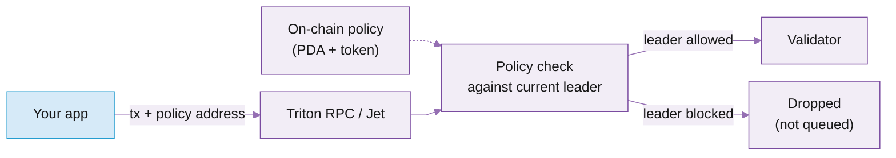

# Shield Protection

Yellowstone Shield lets you control which validators handle your Solana transactions. You create an on-chain policy listing validators you trust (an allowlist) or do not trust (a blocklist), attach the policy when you send, and your transaction only goes to validators that match.

Solana's leader schedule is deterministic, so you often know which validator will process your transaction. If that leader runs sandwich attacks, frontrunning, or other harmful MEV, a normal send still routes to them. Shield is how you opt out. Background: [Introducing Yellowstone Shield](https://blog.triton.one/introducing-yellowstone-shield).

## Use cases

* **Trading apps and wallets** protecting swaps from sandwich attacks and frontrunning by never sending to validators known for them.
* **Senders that route only to vetted validators**: top validators by stake, geographically distributed sets, or performance-based allowlists.
* **RPC providers and transaction forwarders** enforcing policy-based routing for their users.

## Features and benefits

<table data-card-size="large" data-view="cards"><thead><tr><th></th><th></th><th data-hidden data-card-target data-type="content-ref"></th></tr></thead><tbody><tr><td><i class="fa-filter">:filter:</i> <strong>Allowlist or blocklist</strong></td><td>Two strategies: forward only to validators on your allowlist, or never to validators on your blocklist.</td><td></td></tr><tr><td><i class="fa-bolt">:bolt:</i> <strong>Out of the box on Triton</strong></td><td>Add <code>forwardingPolicies</code> to any send through Triton. No extra infrastructure, no separate charge.</td><td></td></tr><tr><td><i class="fa-cube">:cube:</i> <strong>On-chain and transparent</strong></td><td>Each policy is a Program Derived Address anyone can inspect, and anyone who knows the address can use it.</td><td></td></tr><tr><td><i class="fa-key">:key:</i> <strong>Token-gated management</strong></td><td>A Token Extensions asset controls each policy. Hold a token to manage it; mint more to share control.</td><td></td></tr><tr><td><i class="fa-users">:users:</i> <strong>Community policies</strong></td><td>Reuse maintained allow and deny lists from the policy explorer instead of curating your own.</td><td></td></tr><tr><td><i class="fa-gauge-high">:gauge-high:</i> <strong>Fast enforcement</strong></td><td>Policies are cached and checked in the sender via the shield store, with atomic updates and thread-safe checks.</td><td></td></tr></tbody></table>

## How it works

1. **Create a policy**: an on-chain list of identities (typically validators) with an `allow` or `deny` strategy. The policy lives at a Program Derived Address, paired with an SPL token (Token Extensions): creating it mints you 1 token and keeps you the mint authority.
2. **Attach the policy address to your transactions**, either as the `forwardingPolicies` parameter on `sendTransaction` or as an HTTP header.
3. **The sender checks the current leader against your policy** on every send and forwards only when it passes. If the leader fails the check, the transaction is dropped, not held or queued.



Ownership follows the token. Anyone holding a policy's token can manage it (add or remove validators), and because the token is fungible and mintable, you can mint and send tokens to share policy management with others. The policy itself is public: anyone who knows its address can use it in their transactions.


Shield only works with Shield-enabled senders (Triton RPC, or the Jet TPU client). A standard Solana RPC ignores the policy parameter and sends to every leader.


## Finding and using an existing policy

Browse the policy explorer at [validators.app/yellowstone-shield](https://www.validators.app/yellowstone-shield?locale=en\&network=mainnet) to see all existing policies, which validators each includes or excludes, and when it was last updated, then copy the policy address for your transactions. Common policy types:

* **Allow lists**: top validators by stake, geographically distributed validators, performance-based selection.
* **Block lists (deny lists)**: validators known for sandwich attacks or frontrunning, poor performers, community-flagged validators.

Attach the policy to your sends through Triton:



```json
{
  "jsonrpc": "2.0",
  "id": 1,
  "method": "sendTransaction",
  "params": [
    "<base64_encoded_transaction>",
    {
      "encoding": "base64",
      "skipPreflight": true,
      "forwardingPolicies": ["<your_policy_pda>"]
    }
  ]
}
```



Comma-separated for multiple policies:

```
Solana-ForwardingPolicies: "<your_policy_pda>,<your_policy_pda2>"
```



The standard web3.js `sendTransaction` wrapper does not pass the policy parameter, so make the RPC call directly:

```typescript
import { Transaction } from "@solana/web3.js";
import bs58 from "bs58";

const transaction = new Transaction().add(/* your instructions */);
const signedTx = await wallet.signTransaction(transaction);
const serializedTx = bs58.encode(signedTx.serialize());

const response = await fetch("https://<your-endpoint>.rpcpool.com/<your-token>", {
  method: "POST",
  headers: { "Content-Type": "application/json" },
  body: JSON.stringify({
    jsonrpc: "2.0",
    id: 1,
    method: "sendTransaction",
    params: [
      serializedTx,
      {
        encoding: "base58",
        skipPreflight: true,
        forwardingPolicies: ["<your_policy_pda>"],
      },
    ],
  }),
});

const result = await response.json();
const signature = result.result;
```



Running your own sender instead of sending through Triton RPC? The Jet TPU client enforces the same policies inside your own process: follow the [Shield protection guide](https://app.gitbook.com/s/TpqU5Dqc6tdzY8J23dd7/solana/sending-transactions/protect-transactions-with-shield) and the [Jet TPU client guide](https://app.gitbook.com/s/TpqU5Dqc6tdzY8J23dd7/solana/sending-transactions/yellowstone-jet-tpu-client).

## Creating your own policy

You need the Solana CLI installed and configured, SOL for transaction fees, and a list of validator addresses.

**1. Install the Shield CLI.**

```bash
git clone https://github.com/rpcpool/yellowstone-shield
cd yellowstone-shield
cargo build --release --bin yellowstone-shield-cli
```

**2. Prepare metadata.** Create a JSON file describing your policy, upload it to IPFS or Arweave, and save the URL:

```json
{
  "name": "My Validator Policy",
  "symbol": "MVP",
  "description": "Blocks validators known for sandwich attacks",
  "image": "https://your-image-url.com/image.png",
  "external_url": "https://your-website.com",
  "attributes": []
}
```

**3. Create the policy.** `--strategy deny` blocks the listed validators; `--strategy allow` permits only the listed validators.

```bash
yellowstone-shield-cli policy create \
  --strategy deny \
  --name "My Validator Policy" \
  --symbol "MVP" \
  --uri "https://your-metadata-url.json"
```

The CLI outputs your policy's mint address: save it. You receive 1 token and retain mint authority, so you can mint more tokens later to share policy management.

**4. Add validators.** Create a text file with one validator address per line, then:

```bash
yellowstone-shield-cli identities add \
  --mint <your_mint_address> \
  --identities-path validators.txt
```

**Managing the policy.** You must hold at least 1 policy token to manage it; if you transfer all your tokens away, you lose the ability to manage the policy.

```bash
# Replace the entire validator list
yellowstone-shield-cli identities update \
  --mint <mint_address> \
  --identities-path new_validators.txt

# Remove specific validators
yellowstone-shield-cli identities remove \
  --mint <mint_address> \
  --identities-path validators_to_remove.txt

# View policy details
yellowstone-shield-cli policy show --mint <mint_address>
```

## Limitations

Shield is a filter, not a guarantee.

* **Policies need active maintenance.** New validators join every epoch and a bad actor can appear at any time. A blocklist only protects against what is on it, so the quality of protection depends entirely on how current the list is kept.
* **Strict policies can drop time-sensitive transactions.** When no eligible leader is available the transaction is dropped, not queued. Be careful pairing a tight allowlist with arbitrage or liquidations.
* **Only Shield-enabled senders enforce policies.** A standard Solana RPC ignores `forwardingPolicies`, and the standard web3.js `sendTransaction` wrapper does not pass it: make direct RPC calls as shown in the TypeScript tab above.

## For RPC providers

Running your own RPC and want to support Shield?

* **Yellowstone Jet**: Shield support is built in.
* **Custom integration**: use the [yellowstone-shield-store](https://crates.io/crates/yellowstone-shield-store) crate to cache policies locally with atomic updates, check validators against policies thread-safely, and integrate the checks with your transaction forwarding logic.

## Pricing

Shield is applied for free when your transactions route through Triton. You pay only for the transaction itself: the `sendTransaction` or `sendTx` call, billed as one RPC request.

## What's next

<table data-card-size="large" data-view="cards"><thead><tr><th></th><th></th><th data-hidden data-card-target data-type="content-ref"></th></tr></thead><tbody><tr><td><i class="fa-shield">:shield:</i> <strong>Shield protection guide</strong></td><td>The full walkthrough: choose RPC or TPU-client enforcement, pick a policy, and protect your sends.</td><td><a href="https://app.gitbook.com/s/TpqU5Dqc6tdzY8J23dd7/solana/sending-transactions/protect-transactions-with-shield">Shield protection guide</a></td></tr><tr><td><i class="fa-play">:play:</i> <strong>Quickstart</strong></td><td>Send a transaction through Triton in a few minutes.</td><td><a href="https://app.gitbook.com/s/Xz3Ki4zincxsnRG91NNt/solana/sending-transactions/quickstart">Quickstart</a></td></tr><tr><td><i class="fa-newspaper">:newspaper:</i> <strong>Introducing Yellowstone Shield</strong></td><td>The launch post: why validator-level MEV happens and how Shield closes the gap.</td><td><a href="https://blog.triton.one/introducing-yellowstone-shield">Introducing Yellowstone Shield</a></td></tr></tbody></table>

***

<i class="fa-life-ring">:life-ring:</i> Contact support by clicking the chat icon in your [customer dashboard](https://customers.triton.one)\
<i class="fa-briefcase">:briefcase:</i> Sales questions? [Contact us](https://triton.one/contact)\
<i class="fa-sparkles">:sparkles:</i> AI agent? Read [llms.txt](https://docs.triton.one/llms.txt)\
<i class="fa-rss">:rss:</i> Follow updates: [Blog](https://blog.triton.one) · [X](https://x.com/triton_one) · [YouTube](https://www.youtube.com/@triton_one_ltd) · [Telegram](https://t.me/tritonone) · [GitHub](https://github.com/rpcpool)
