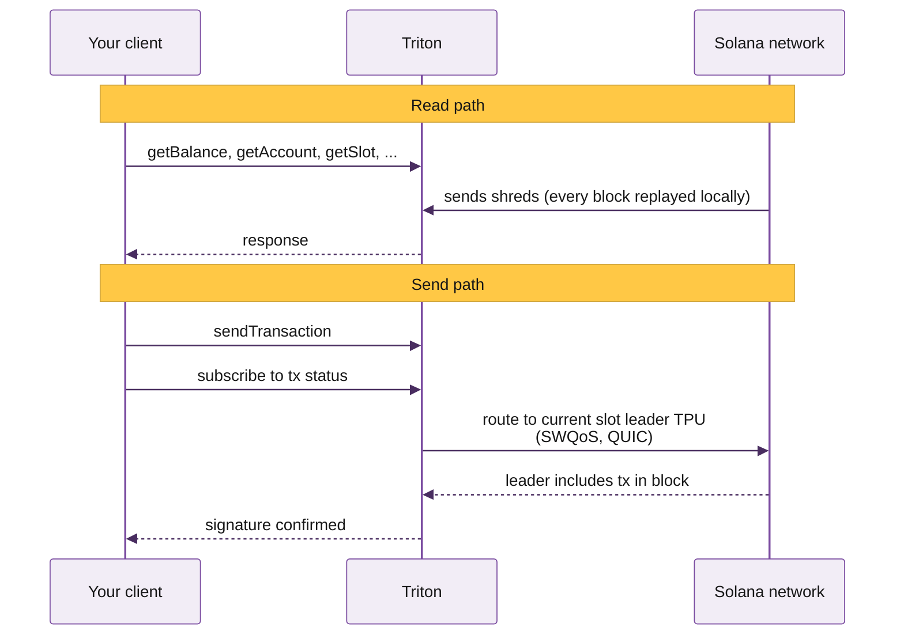

# Welcome to Triton

Premium bare-metal Solana infrastructure: reads, streaming, history, trading APIs, and validator services. Built for teams running production workloads.

Here you'll find everything you need to integrate with Triton's Solana infrastructure. If you're new here, start with the Quickstart for a five-minute walk-through, or jump to the common build guides for the path that matches what you're shipping.

## Why teams pick Triton

On Solana, your RPC provider sits in the path of every read your application makes and every transaction it sends. Your app inherits whatever reliability and latency they deliver, setting the ceiling on what you can build.

Depending on the workload, four things matter at different ratios: reliability, low latency, direct engineer support, and consistent capacity. We commit to all four without compromise. Here's how:

* **Premium bare metal across 20+ PoPs on three continents**, GeoDNS-routed with continuous health checks, load balancing, and automatic failover.
* **Hardware tuned for the workload it serves.** Read clusters, streaming nodes, historical indexers, and TPU clients all run on machines configured for their specific role.
* **Direct engineer support.** The person who replies to your ticket is on the team that built the component you're asking about.
* **Consistent capacity.** Our shared infrastructure is purpose-built to absorb spikes across the cluster without affecting your QoS.



## Solana networks we support

Production workloads usually come last. You prototype locally, push to devnet for integration tests, then graduate to mainnet for real traffic. Triton supports every endpoint type on both networks:

* **Mainnet**: production traffic ([learn more](https://solana.com/docs/references/clusters#mainnet-beta))
* **Devnet**: free, for development and integration tests ([learn more](https://solana.com/docs/references/clusters#devnet))

| Network        | <p>HTTPS<br>RPC</p> | <p>Web<br>Sockets</p> | <p>Yellowstone<br>gRPC</p> | Fumarole | <p>Steamboat<br>indexed</p> | <p>Hydrant<br>archive</p> |
| -------------- | :-----------------: | :-------------------: | :------------------------: | :------: | :-------------------------: | :-----------------------: |
| Solana mainnet |          ✓          |           ✓           |              ✓             |     ✓    |              ✓              |             ✓             |
| Solana devnet  |          ✓          |           ✓           |              ✓             |     ✗    |           v1 only           |             ✓             |

## Triton stack overview

For most workloads, shared is the right answer. Solana's read layer has split into purpose-built components, which makes geographic distribution and per-component scaling the dominant factors for both low latency and spike absorption.

The exception is gRPC streaming. Dragon's Mouth connects directly to Geyser, and a dedicated node gives you full bandwidth and CPU, flat costs on streaming bandwidth, and absolute minimal latency when colocated.



<table data-card-size="large" data-view="cards"><thead><tr><th></th><th></th><th data-hidden data-card-target data-type="content-ref"></th></tr></thead><tbody><tr><td><i class="fa-database">:database:</i> <strong>Steamboat</strong></td><td></td><td></td></tr><tr><td><i class="fa-image">:image:</i> <strong>DAS API</strong></td><td></td><td></td></tr><tr><td><i class="fa-arrows-rotate">:arrows-rotate:</i> <strong>Account Sync</strong></td><td></td><td></td></tr></tbody></table>



<table data-card-size="large" data-view="cards"><thead><tr><th></th><th></th><th data-hidden data-card-target data-type="content-ref"></th></tr></thead><tbody><tr><td><i class="fa-radio">:radio:</i> <strong>Dragon's Mouth gRPC</strong></td><td></td><td></td></tr><tr><td><i class="fa-fire">:fire:</i> <strong>Deshred transactions</strong></td><td></td><td></td></tr><tr><td><i class="fa-rotate-right">:rotate-right:</i> <strong>Whirligig</strong></td><td></td><td></td></tr><tr><td><i class="fa-layer-group">:layer-group:</i> <strong>Fumarole</strong></td><td></td><td></td></tr><tr><td><i class="fa-chart-line">:chart-line:</i> <strong>Hermes</strong></td><td></td><td></td></tr><tr><td><strong>Pythnet</strong></td><td></td><td></td></tr></tbody></table>



<table data-card-size="large" data-view="cards"><thead><tr><th></th><th></th><th data-hidden data-card-target data-type="content-ref"></th></tr></thead><tbody><tr><td><i class="fa-paper-plane">:paper-plane:</i> <strong>Jet sender</strong></td><td></td><td></td></tr><tr><td><i class="fa-arrow-trend-up">:arrow-trend-up:</i> <strong>Priority Fees API</strong></td><td></td><td></td></tr><tr><td><i class="fa-code-branch">:code-branch:</i> <strong>Metis</strong></td><td></td><td></td></tr><tr><td><i class="fa-route">:route:</i> <strong>Titan Prime</strong></td><td></td><td></td></tr><tr><td><i class="fa-box">:box:</i> <strong>Jito Bundles</strong></td><td></td><td></td></tr></tbody></table>



<table data-card-size="large" data-view="cards"><thead><tr><th></th><th></th><th data-hidden data-card-target data-type="content-ref"></th></tr></thead><tbody><tr><td><i class="fa-server">:server:</i> <strong>Dedicated gRPC node</strong></td><td></td><td></td></tr><tr><td><i class="fa-landmark">:landmark:</i> <strong>White-label validator</strong></td><td></td><td></td></tr><tr><td><i class="fa-landmark">:landmark:</i> <strong>Private trusted validator</strong></td><td></td><td></td></tr></tbody></table>



## For AI agents

Triton's docs are built for humans and AI agents alike. The single-file index lives at:

```
https://docs.triton.one/llms.txt
```

Drop that URL into your agent's context (Claude Code, Cursor, Codex) for full Triton coverage in one fetch. Per-product `llms.txt` files are also available under each section, e.g. `/solana/streaming/dragons-mouth/llms.txt`.

A native Triton MCP server is **coming soon**, with direct access to RPC queries, gRPC streams, and account management.

## Common builds

The most-asked builder paths. Each card jumps to a working walkthrough with code.

<table data-card-size="large" data-view="cards"><thead><tr><th></th><th></th><th data-hidden data-card-target data-type="content-ref"></th></tr></thead><tbody><tr><td><i class="fa-tower-broadcast">:tower-broadcast:</i> <strong>Stream Solana with gRPC</strong></td><td>Subscribe to accounts, transactions, and blocks via Dragon's Mouth, end to end.</td><td></td></tr><tr><td><i class="fa-image">:image:</i> <strong>Get token metadata</strong></td><td>Query NFT and cNFT metadata fast with a single DAS API call.</td><td></td></tr><tr><td><i class="fa-copy">:copy:</i> <strong>Copy trade a wallet</strong></td><td>Watch any wallet in real time and mirror its trades.</td><td></td></tr><tr><td><i class="fa-calculator">:calculator:</i> <strong>Calculate Solana fees end to end</strong></td><td>Base fees, priority fees, and account rent explained.</td><td></td></tr><tr><td><i class="fa-droplet">:droplet:</i> <strong>Stream a Raydium AMM pool</strong></td><td>Subscribe to pool state and trade events sub-slot.</td><td></td></tr><tr><td><i class="fa-sparkles">:sparkles:</i> <strong>Mint a Solana token</strong></td><td>Create an SPL, Token-2022, or P-Token mint. Set metadata, airdrop to test wallets.</td><td></td></tr><tr><td><i class="fa-route">:route:</i> <strong>Integrate Titan Prime</strong></td><td>Streaming swap quotes and routes that re-optimise live as the market moves.</td><td></td></tr></tbody></table>

***

## What's next?

New to Triton? Four steps from here to a production endpoint.

<table data-card-size="large" data-view="cards"><thead><tr><th></th><th></th><th data-hidden data-card-target data-type="content-ref"></th></tr></thead><tbody><tr><td><i class="fa-user-gear">:user-gear:</i> <strong>Account management</strong></td><td>Customer dashboard tour: endpoints, billing, team, and support.</td><td><a href="platform-overview">platform-overview</a></td></tr><tr><td><i class="fa-credit-card">:credit-card:</i> <strong>Plans and billing</strong></td><td>Pay-as-you-go vs invoiced, top-ups, and the cost calculator across shared and dedicated setups.</td><td><a href="plans-and-billing">plans-and-billing</a></td></tr><tr><td><i class="fa-rocket">:rocket:</i> <strong>Quickstart</strong></td><td>Sign up, deposit, get an endpoint, send your first request.</td><td><a href="quickstart">quickstart</a></td></tr><tr><td><i class="fa-user-plus">:user-plus:</i> <strong>How to sign up</strong></td><td>Step-by-step from clicking signup to a live Triton endpoint.</td><td></td></tr></tbody></table>
