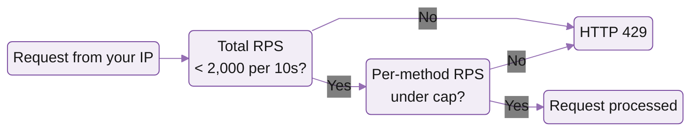

# Rate and connection limits

We apply 2 kinds of limits: rate limits for HTTP requests (per IP, 10-second window) and connection limits for streaming (simultaneous connections per endpoint).

## Rate limits

Two budgets apply at the same time, both reset every 10 seconds, both keyed to the IP making the request:

* **Total RPS** is the budget across every method. If your IP sends 1,000 `getBalance` and 1,000 `getSlot` in 10 seconds, that counts as 2,000 against this budget.
* **Per-method RPS** is a separate budget for each individual RPC method. Even if your total is under the cap, you can hit the per-method cap on a single hot method (most often `getProgramAccounts`, `sendTransaction`, or `getBlock`).



If either check fails, the response is `HTTP 429 Too Many Requests`. In practice, most 429s come from the per-method limit, not the total.


**Per IP** means the IP making the request. Backends sharing one IP share one budget.


## Defaults

New accounts on the shared service default to a tier sized for typical workloads (frontends, indexers, light backends). Heavier traffic, especially trading bots and analytics pipelines, often wants higher per-method caps. We can raise yours on request; contact support by clicking the chat icon in the bottom right of your [customer dashboard](https://customers.triton.one).

## Per-method limits

Methods not listed below fall back to the 2,000-per-10s global budget. Limits group by cap, so methods that share a budget appear on the same row.

### Standard JSON-RPC

| Per 10s | Methods                                                                                           |
| ------- | ------------------------------------------------------------------------------------------------- |
| 2,000   | Total RPS per IP, `getAccountInfo`, `getTransaction`                                              |
| 400     | `getMultipleAccounts`, `getVoteAccounts`, `getClusterNodes`                                       |
| 200     | `getBlock`, `getConfirmedTransaction`, `getLeaderSchedule`                                        |
| 100     | `getRecentPerformanceSamples`, `getLatestBlockhash`, `getTokenAccountsByOwner`, `sendTransaction` |
| 50      | `getProgramAccounts`, `getTokenLargestAccounts`                                                   |

### Streaming services (gRPC)

| Per 10s | Service      | Methods                                              |
| ------- | ------------ | ---------------------------------------------------- |
| 5,000   | Old Faithful | `GetBlockTime`, `StreamBlocks`, `StreamTransactions` |
| 2,000   | Fumarole     | all methods                                          |
| 1,000   | Old Faithful | `GetBlock`, `GetTransaction`, `Get`, `GetVersion`    |
| 1,000   | Vixen        | `Subscribe`, `ProgramStreams.Subscribe`              |

## Read your live limits

Every endpoint exposes its current limits at `/ratelimits`:

```bash
curl https://<your-app>.mainnet.rpcpool.com/<token>/ratelimits
```

The response is JSON, listing the request budget per window, every per-method override, and the connection cap. It's the source of truth for **your** endpoint's exact numbers, which can differ from the defaults above if support has tuned them.

Every JSON-RPC response also carries `X-Ratelimit-*` headers. Watch them in your client to back off **before** you hit a 429:

| Header                         | What it tells you                             |
| ------------------------------ | --------------------------------------------- |
| `X-Ratelimit-Limit`            | Total budget for the current 10-second window |
| `X-Ratelimit-Remaining`        | How many total requests you have left         |
| `X-Ratelimit-Reset`            | Seconds until the window resets               |
| `X-Ratelimit-Method-Limit`     | Per-method cap for this RPC                   |
| `X-Ratelimit-Method-Remaining` | How many of this method you have left         |

If you do hit a 429, see the Error handling guide for the full debug flow.

## Browser concurrency

Browsers cap parallel HTTP/2 streams to a single host, so a frontend with many parallel calls can self-throttle before Triton's limits ever apply. Best practices:

* Use a single shared `Connection` (web3.js) per page
* Batch reads with `getMultipleAccounts` instead of N parallel `getAccountInfo` calls
* Move heavy reads (program scans, signature crawls) to your backend

## Connection limits

Streaming products (Yellowstone gRPC, Whirligig WebSockets, Fumarole) cap **simultaneous connections per endpoint**, not request rate.

Connection limits are flexible. If you hit one, contact support by clicking the chat icon in the bottom right of your [customer dashboard](https://customers.triton.one) and we'll work with you to either optimise usage or raise the cap.


A single gRPC connection can multiplex many subscriptions. The right pattern is one connection plus many subscribe messages, not one connection per filter. See Multiplexing in one connection on Dragon's Mouth for the canonical example.


## What's next

<table data-card-size="large" data-view="cards"><thead><tr><th></th><th></th><th data-hidden data-card-target data-type="content-ref"></th></tr></thead><tbody><tr><td><i class="fa-credit-card">:credit-card:</i> <strong>Plans and billing</strong></td><td>Pay-as-you-go vs invoiced, top-ups, and the cost calculator across shared and dedicated setups.</td><td><a href="plans-and-billing">plans-and-billing</a></td></tr><tr><td><i class="fa-server">:server:</i> <strong>Dedicated gRPC node</strong></td><td>Private node with isolated CPU and unlimited concurrent gRPC connections. For latency-sensitive or heavy streaming workloads.</td><td></td></tr></tbody></table>
